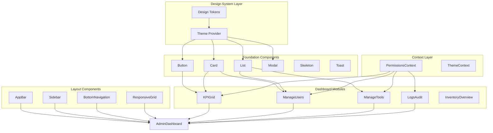

# Design Document: Admin Dashboard Redesign

## Overview

Este documento describe el diseño técnico para el rediseño completo del Admin Dashboard siguiendo un Design System unificado. La arquitectura se basa en componentes React reutilizables con TypeScript, integración con el sistema de permisos existente (`PermissionsContext`), y un enfoque mobile-first con soporte completo para dark mode.

El diseño prioriza:
- **Componentización**: Componentes independientes y reutilizables
- **Type Safety**: Interfaces TypeScript estrictas para todos los componentes
- **Performance**: Lazy loading, virtualización, y optimización de re-renders
- **Accessibility**: WCAG 2.1 AA compliance con soporte para lectores de pantalla

## Architecture



### Directory Structure

```
src/
├── design-system/
│   ├── tokens/
│   │   ├── colors.ts
│   │   ├── spacing.ts
│   │   ├── typography.ts
│   │   └── index.ts
│   ├── theme/
│   │   ├── ThemeProvider.tsx
│   │   └── useTheme.ts
│   └── index.ts
├── components/
│   ├── ds/                      # Design System Components
│   │   ├── Button/
│   │   │   ├── Button.tsx
│   │   │   ├── Button.types.ts
│   │   │   └── index.ts
│   │   ├── Card/
│   │   ├── MetricCard/
│   │   ├── ActionCard/
│   │   ├── List/
│   │   ├── Modal/
│   │   ├── Skeleton/
│   │   ├── Toast/
│   │   └── EmptyState/
│   ├── layout/
│   │   ├── AppBar/
│   │   ├── Sidebar/
│   │   ├── BottomNavigation/
│   │   └── ResponsiveGrid/
│   └── admin-dashboard/
│       ├── KPIGrid/
│       ├── ManageUsers/
│       ├── ManageTools/
│       ├── LogsAudit/
│       └── AdminDashboardContainer.tsx
└── hooks/
    ├── useResponsive.ts
    ├── usePermissionGuard.ts
    └── useToast.ts
```

## Components and Interfaces

### Design Tokens

```typescript
// src/design-system/tokens/colors.ts
export const colors = {
  // Primary
  primary: '#E50914',
  primaryHover: '#FF2A2A',
  
  // Semantic
  accent: '#4ADE80',
  warning: '#F59E0B',
  danger: '#EF4444',
  
  // Neutrals (Dark UI)
  background: '#0B0F14',
  surface: '#151A21',
  card: '#1E2430',
  border: '#2A3242',
  
  // Text
  textPrimary: '#FFFFFF',
  textSecondary: '#9CA3AF',
  disabled: '#6B7280',
} as const;

// src/design-system/tokens/spacing.ts
export const spacing = {
  xs: 4,
  sm: 8,
  md: 12,
  lg: 16,
  xl: 24,
  xxl: 32,
} as const;

// src/design-system/tokens/typography.ts
export const typography = {
  fontFamily: "'Inter', 'SF Pro', 'Roboto', sans-serif",
  fontWeights: {
    regular: 400,
    semibold: 600,
  },
  sizes: {
    xs: '0.75rem',    // 12px
    sm: '0.875rem',   // 14px
    base: '1rem',     // 16px
    lg: '1.125rem',   // 18px
    xl: '1.25rem',    // 20px
    '2xl': '1.5rem',  // 24px
    '3xl': '1.875rem', // 30px
  },
} as const;

// src/design-system/tokens/borders.ts
export const borders = {
  radius: {
    button: 10,
    card: 12,
    modal: 16,
  },
} as const;
```

### Breakpoints and Responsive Hook

```typescript
// src/design-system/tokens/breakpoints.ts
export const breakpoints = {
  mobile: 0,
  tablet: 768,
  desktop: 1024,
} as const;

// src/hooks/useResponsive.ts
export interface ResponsiveState {
  isMobile: boolean;
  isTablet: boolean;
  isDesktop: boolean;
  breakpoint: 'mobile' | 'tablet' | 'desktop';
}

export function useResponsive(): ResponsiveState;
```

### Button Component

```typescript
// src/components/ds/Button/Button.types.ts
export type ButtonVariant = 'primary' | 'secondary' | 'ghost' | 'danger';
export type ButtonSize = 'sm' | 'md' | 'lg';

export interface ButtonProps {
  variant?: ButtonVariant;
  size?: ButtonSize;
  disabled?: boolean;
  loading?: boolean;
  fullWidth?: boolean;
  leftIcon?: React.ReactNode;
  rightIcon?: React.ReactNode;
  onClick?: () => void;
  children: React.ReactNode;
  type?: 'button' | 'submit' | 'reset';
  'aria-label'?: string;
}
```

### MetricCard Component

```typescript
// src/components/ds/MetricCard/MetricCard.types.ts
export type TrendDirection = 'up' | 'down' | 'neutral';

export interface MetricCardProps {
  title: string;
  value: string | number;
  trend?: {
    direction: TrendDirection;
    value: string;
  };
  icon?: React.ReactNode;
  loading?: boolean;
  error?: boolean;
  onRetry?: () => void;
}
```

### ActionCard Component

```typescript
// src/components/ds/ActionCard/ActionCard.types.ts
export interface ActionCardProps {
  icon: React.ReactNode;
  title: string;
  description?: string;
  highlighted?: boolean;
  disabled?: boolean;
  onClick?: () => void;
  'aria-label'?: string;
}
```

### List Components

```typescript
// src/components/ds/List/List.types.ts
export type ListItemStatus = 'active' | 'pending' | 'error' | 'inactive';

export interface ListItemProps {
  id: string | number;
  primary: string;
  secondary?: string;
  status?: ListItemStatus;
  action?: React.ReactNode;
  onClick?: () => void;
}

export interface ListProps {
  items: ListItemProps[];
  loading?: boolean;
  emptyState?: React.ReactNode;
  virtualized?: boolean;
  onItemClick?: (item: ListItemProps) => void;
}
```

### Modal Component

```typescript
// src/components/ds/Modal/Modal.types.ts
export interface ModalProps {
  isOpen: boolean;
  onClose: () => void;
  title: string;
  children: React.ReactNode;
  footer?: React.ReactNode;
  size?: 'sm' | 'md' | 'lg' | 'full';
  closeOnBackdrop?: boolean;
  closeOnEscape?: boolean;
}
```

### Toast System

```typescript
// src/components/ds/Toast/Toast.types.ts
export type ToastType = 'success' | 'error' | 'warning' | 'info';

export interface ToastData {
  id: string;
  type: ToastType;
  message: string;
  duration?: number;
}

export interface ToastContextValue {
  toasts: ToastData[];
  showToast: (type: ToastType, message: string, duration?: number) => void;
  dismissToast: (id: string) => void;
}
```

### Layout Components

```typescript
// src/components/layout/AppBar/AppBar.types.ts
export interface AppBarProps {
  title?: string;
  showNotifications?: boolean;
  showUserMenu?: boolean;
  onMenuClick?: () => void;
}

// src/components/layout/BottomNavigation/BottomNavigation.types.ts
export interface NavItem {
  id: string;
  label: string;
  icon: React.ReactNode;
  href: string;
  permission?: string;
}

export interface BottomNavigationProps {
  items: NavItem[];
  activeId?: string;
}

// src/components/layout/Sidebar/Sidebar.types.ts
export interface SidebarProps {
  collapsed?: boolean;
  onToggle?: () => void;
  items: NavItem[];
}

// src/components/layout/ResponsiveGrid/ResponsiveGrid.types.ts
export interface ResponsiveGridProps {
  children: React.ReactNode;
  columns?: {
    mobile?: number;
    tablet?: number;
    desktop?: number;
  };
  gap?: number;
}
```

### Permission Guard Hook

```typescript
// src/hooks/usePermissionGuard.ts
export interface PermissionGuardOptions {
  permissions: string[];
  requireAll?: boolean;
}

export interface PermissionGuardResult {
  hasAccess: boolean;
  isLoading: boolean;
}

export function usePermissionGuard(options: PermissionGuardOptions): PermissionGuardResult;
```

### Dashboard Module Components

```typescript
// src/components/admin-dashboard/KPIGrid/KPIGrid.types.ts
export interface KPIData {
  totalLoans: number;
  activeUsers: number;
  pendingReturns: number;
  inventoryAlerts: number;
  trends: {
    loans: TrendDirection;
    users: TrendDirection;
    returns: TrendDirection;
    alerts: TrendDirection;
  };
}

export interface KPIGridProps {
  data?: KPIData;
  loading?: boolean;
  error?: Error | null;
  onRefresh?: () => void;
}

// src/components/admin-dashboard/types.ts
export interface DashboardModuleProps {
  requiredPermissions: string[];
  children: React.ReactNode;
}
```

### Skeleton Components

```typescript
// src/components/ds/Skeleton/Skeleton.types.ts
export interface SkeletonProps {
  variant?: 'text' | 'circular' | 'rectangular';
  width?: string | number;
  height?: string | number;
  animation?: 'pulse' | 'wave' | 'none';
}

export interface SkeletonCardProps {
  showIcon?: boolean;
  lines?: number;
}
```

### Empty State Component

```typescript
// src/components/ds/EmptyState/EmptyState.types.ts
export interface EmptyStateProps {
  icon?: React.ReactNode;
  title: string;
  description?: string;
  action?: {
    label: string;
    onClick: () => void;
  };
}
```

### Error State Component

```typescript
// src/components/ds/ErrorState/ErrorState.types.ts
export interface ErrorStateProps {
  title?: string;
  message: string;
  onRetry?: () => void;
  showSupport?: boolean;
}
```

## Data Models

### Theme Configuration

```typescript
// src/design-system/theme/theme.types.ts
export interface Theme {
  colors: typeof colors;
  spacing: typeof spacing;
  typography: typeof typography;
  borders: typeof borders;
  breakpoints: typeof breakpoints;
}

export interface ThemeContextValue {
  theme: Theme;
  isDarkMode: boolean;
}
```

### Dashboard State

```typescript
// src/components/admin-dashboard/state.types.ts
export interface DashboardState {
  kpiData: KPIData | null;
  isLoading: boolean;
  error: Error | null;
  lastRefresh: Date | null;
  sidebarCollapsed: boolean;
}

export interface DashboardActions {
  refreshKPIs: () => Promise<void>;
  toggleSidebar: () => void;
  setError: (error: Error | null) => void;
}
```

### Module Visibility State

```typescript
// src/components/admin-dashboard/visibility.types.ts
export interface ModuleVisibility {
  kpiGrid: boolean;
  manageUsers: boolean;
  manageTools: boolean;
  logsAudit: boolean;
  inventoryOverview: boolean;
}

export interface VisibleModule {
  id: string;
  component: React.ComponentType;
  order: number;
}
```

### Navigation State

```typescript
// src/components/layout/navigation.types.ts
export interface NavigationState {
  activeRoute: string;
  sidebarOpen: boolean;
  mobileMenuOpen: boolean;
}
```


## Correctness Properties

*A property is a characteristic or behavior that should hold true across all valid executions of a system—essentially, a formal statement about what the system should do. Properties serve as the bridge between human-readable specifications and machine-verifiable correctness guarantees.*

### Property 1: Design Token Completeness

*For any* design token category (colors, spacing, typography, borders), the exported token object SHALL contain all required keys with valid values as specified in the requirements.

**Validates: Requirements 1.1, 1.2, 1.4, 1.5**

### Property 2: Spacing Token Multiples

*For any* spacing token value in the spacing object, the value SHALL be a multiple of 4.

**Validates: Requirements 1.3**

### Property 3: Breakpoint Detection Consistency

*For any* viewport width, the `useResponsive` hook SHALL return exactly one breakpoint ('mobile' for width < 768, 'tablet' for 768 ≤ width < 1024, 'desktop' for width ≥ 1024) and the corresponding boolean flags SHALL be mutually exclusive.

**Validates: Requirements 2.1, 2.2, 2.3**

### Property 4: Bottom Navigation Visibility

*For any* viewport width, the Bottom_Navigation component SHALL render only when the breakpoint is 'mobile' (width < 768px).

**Validates: Requirements 2.6, 5.6**

### Property 5: Navigation Item Limit

*For any* array of navigation items passed to Bottom_Navigation, the component SHALL render at most 5 items, truncating excess items.

**Validates: Requirements 5.1**

### Property 6: Module Permission Filtering

*For any* set of user permissions and any dashboard module with required permissions, the module SHALL be visible if and only if the user has at least one of the required permissions (using `hasAnyPermission`).

**Validates: Requirements 3.2, 11.2, 12.1, 12.2, 12.3**

### Property 7: Module Reordering on Filter

*For any* set of visible modules after permission filtering, the modules SHALL maintain their relative order and fill available grid positions without gaps.

**Validates: Requirements 3.3**

### Property 8: Metric Card Trend Indicator

*For any* MetricCard with a trend prop, the component SHALL render an up arrow for 'up' direction, down arrow for 'down' direction, and no arrow for 'neutral' direction.

**Validates: Requirements 6.4, 6.5**

### Property 9: Component Loading State

*For any* component that accepts a `loading` prop (MetricCard, List, KPIGrid), when loading is true, the component SHALL render a skeleton placeholder instead of content.

**Validates: Requirements 6.6, 13.1**

### Property 10: Metric Card Content Rendering

*For any* MetricCard with title, value, and optional icon props, all provided props SHALL be rendered in the component output.

**Validates: Requirements 6.1, 6.7**

### Property 11: Action Card Disabled State

*For any* ActionCard with disabled=true, clicking the card SHALL NOT trigger the onClick callback.

**Validates: Requirements 7.6**

### Property 12: Button Disabled State

*For any* Button component with disabled=true, clicking the button SHALL NOT trigger the onClick callback.

**Validates: Requirements 8.7**

### Property 13: Button Loading State

*For any* Button component with loading=true, the component SHALL render a loading spinner and the button SHALL be non-interactive.

**Validates: Requirements 8.8**

### Property 14: List Status Indicator

*For any* List item with a status prop, the component SHALL render the correct status indicator color: 'active' → Accent, 'pending' → Warning, 'error' → Danger.

**Validates: Requirements 9.2**

### Property 15: List Virtualization Threshold

*For any* List component with more than 50 items, virtualization SHALL be enabled automatically.

**Validates: Requirements 9.5**

### Property 16: List Empty State

*For any* List component with an empty items array, the component SHALL render the empty state instead of the list.

**Validates: Requirements 9.6**

### Property 17: Modal Breakpoint Variant

*For any* Modal component, when on mobile breakpoint it SHALL render as a Bottom_Sheet variant, and when on desktop it SHALL render as a centered dialog variant.

**Validates: Requirements 10.4, 10.5**

### Property 18: Modal Close Triggers

*For any* open Modal, clicking the backdrop (when closeOnBackdrop=true) or pressing Escape (when closeOnEscape=true) SHALL call the onClose callback.

**Validates: Requirements 10.6**

### Property 19: KPI Grid Metrics

*For any* KPIGrid component with valid data, exactly 4 MetricCards SHALL be rendered for: total loans, active users, pending returns, and inventory alerts.

**Validates: Requirements 11.3**

### Property 20: KPI Grid Error State

*For any* KPIGrid component with an error prop set, the component SHALL render an error state with a retry button instead of the metrics.

**Validates: Requirements 11.4**

### Property 21: Admin Module Header Count

*For any* admin module (ManageUsers, ManageTools, LogsAudit) with data, the header SHALL display the item count in the format "Title (count)".

**Validates: Requirements 12.5**

### Property 22: Toast Type Rendering

*For any* toast notification, the toast SHALL use Accent color for 'success' type and Danger color for 'error' type.

**Validates: Requirements 13.3, 13.4**

### Property 23: Toast Auto-Dismiss

*For any* toast notification without manual dismissal, the toast SHALL be automatically removed after 4000ms.

**Validates: Requirements 13.5**

### Property 24: Toast Stack Limit

*For any* number of concurrent toasts, at most 3 toasts SHALL be visible at once, with newer toasts replacing older ones when the limit is exceeded.

**Validates: Requirements 13.6**

### Property 25: Empty State Content

*For any* EmptyState component with title, description, and optional action props, all provided props SHALL be rendered in the component output.

**Validates: Requirements 14.2, 14.3**

### Property 26: Error State Retry

*For any* ErrorState component with an onRetry callback, clicking the retry button SHALL call the onRetry callback exactly once.

**Validates: Requirements 15.4**

### Property 27: Error State Support Message

*For any* ErrorState component where retry has been attempted more than 3 times, the component SHALL display a "contact support" message.

**Validates: Requirements 15.5**

### Property 28: Notification Badge Count

*For any* AppBar with notifications, the badge SHALL display the exact unread count, or "99+" if count exceeds 99.

**Validates: Requirements 4.3**

### Property 29: Naming Convention - Variants

*For any* component variant string, the string SHALL match the kebab-case pattern (lowercase letters and hyphens only).

**Validates: Requirements 17.2**

### Property 30: Naming Convention - Tokens

*For any* design token key, the key SHALL match the camelCase pattern (starting with lowercase, no hyphens or underscores).

**Validates: Requirements 17.3**

## Error Handling

### API Error Handling

```typescript
// src/utils/errorHandling.ts
export interface ApiError {
  code: string;
  message: string;
  details?: Record<string, unknown>;
}

export function handleApiError(error: unknown): ApiError {
  if (error instanceof Response) {
    return {
      code: `HTTP_${error.status}`,
      message: getHttpErrorMessage(error.status),
    };
  }
  
  if (error instanceof Error) {
    return {
      code: 'UNKNOWN_ERROR',
      message: error.message,
    };
  }
  
  return {
    code: 'UNKNOWN_ERROR',
    message: 'An unexpected error occurred',
  };
}

function getHttpErrorMessage(status: number): string {
  const messages: Record<number, string> = {
    400: 'Invalid request',
    401: 'Session expired. Please log in again.',
    403: 'You do not have permission to perform this action',
    404: 'Resource not found',
    500: 'Server error. Please try again later.',
  };
  return messages[status] || 'An error occurred';
}
```

### Component Error Boundaries

Each dashboard module SHALL be wrapped in an error boundary to prevent cascading failures:

```typescript
// src/components/admin-dashboard/ModuleErrorBoundary.tsx
export interface ModuleErrorBoundaryProps {
  moduleName: string;
  children: React.ReactNode;
  onRetry?: () => void;
}

export function ModuleErrorBoundary({ 
  moduleName, 
  children, 
  onRetry 
}: ModuleErrorBoundaryProps): JSX.Element;
```

### Error Recovery Strategies

1. **Transient Errors**: Automatic retry with exponential backoff (1s, 2s, 4s)
2. **Permission Errors**: Display permission denied message, no retry
3. **Network Errors**: Display offline indicator, retry when online
4. **Data Errors**: Display error state with manual retry option

### Toast Error Display

```typescript
// Error toast configuration
const errorToastConfig = {
  type: 'error' as const,
  duration: 6000, // Longer duration for errors
  action: {
    label: 'Retry',
    onClick: () => void,
  },
};
```

## Testing Strategy

### Dual Testing Approach

This design requires both unit tests and property-based tests for comprehensive coverage:

- **Unit tests**: Verify specific examples, edge cases, and error conditions
- **Property tests**: Verify universal properties across all valid inputs

### Property-Based Testing Configuration

- **Library**: fast-check (already installed in the project)
- **Minimum iterations**: 100 per property test
- **Tag format**: `Feature: admin-dashboard-redesign, Property {number}: {property_text}`

### Test Organization

```
tests/
├── design-system/
│   ├── tokens.test.ts           # Properties 1, 2, 29, 30
│   └── tokens.property.test.ts  # Property-based tests for tokens
├── hooks/
│   ├── useResponsive.test.ts    # Property 3
│   └── useResponsive.property.test.ts
├── components/
│   ├── ds/
│   │   ├── Button.test.tsx      # Properties 12, 13
│   │   ├── MetricCard.test.tsx  # Properties 8, 9, 10
│   │   ├── ActionCard.test.tsx  # Property 11
│   │   ├── List.test.tsx        # Properties 14, 15, 16
│   │   ├── Modal.test.tsx       # Properties 17, 18
│   │   ├── Toast.test.tsx       # Properties 22, 23, 24
│   │   ├── EmptyState.test.tsx  # Property 25
│   │   └── ErrorState.test.tsx  # Properties 26, 27
│   ├── layout/
│   │   ├── BottomNavigation.test.tsx  # Properties 4, 5
│   │   └── AppBar.test.tsx            # Property 28
│   └── admin-dashboard/
│       ├── KPIGrid.test.tsx           # Properties 19, 20
│       ├── ModuleVisibility.test.tsx  # Properties 6, 7
│       └── AdminModules.test.tsx      # Property 21
```

### Unit Test Examples

```typescript
// Example: MetricCard unit test
describe('MetricCard', () => {
  it('renders title and value', () => {
    render(<MetricCard title="Total Loans" value={42} />);
    expect(screen.getByText('Total Loans')).toBeInTheDocument();
    expect(screen.getByText('42')).toBeInTheDocument();
  });

  it('shows skeleton when loading', () => {
    render(<MetricCard title="Total Loans" value={42} loading />);
    expect(screen.getByTestId('skeleton')).toBeInTheDocument();
  });
});
```

### Property Test Examples

```typescript
// Example: Property test for spacing tokens
import * as fc from 'fast-check';
import { spacing } from '@/design-system/tokens';

describe('Design Tokens Properties', () => {
  // Feature: admin-dashboard-redesign, Property 2: Spacing Token Multiples
  it('all spacing values are multiples of 4', () => {
    fc.assert(
      fc.property(
        fc.constantFrom(...Object.values(spacing)),
        (value) => value % 4 === 0
      ),
      { numRuns: 100 }
    );
  });
});

// Example: Property test for breakpoint detection
describe('useResponsive Properties', () => {
  // Feature: admin-dashboard-redesign, Property 3: Breakpoint Detection Consistency
  it('returns correct breakpoint for any viewport width', () => {
    fc.assert(
      fc.property(
        fc.integer({ min: 0, max: 3000 }),
        (width) => {
          const result = getBreakpoint(width);
          if (width < 768) return result === 'mobile';
          if (width < 1024) return result === 'tablet';
          return result === 'desktop';
        }
      ),
      { numRuns: 100 }
    );
  });
});
```

### Integration Test Strategy

Integration tests should verify:
1. Permission context integration with dashboard modules
2. Toast system integration with action handlers
3. Responsive layout changes across breakpoints
4. Error boundary recovery flows

### Accessibility Testing

- Use jest-axe for automated accessibility checks
- Manual testing with screen readers (VoiceOver, NVDA)
- Keyboard navigation testing for all interactive elements
