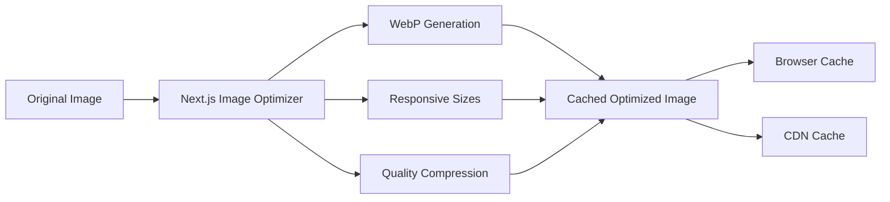
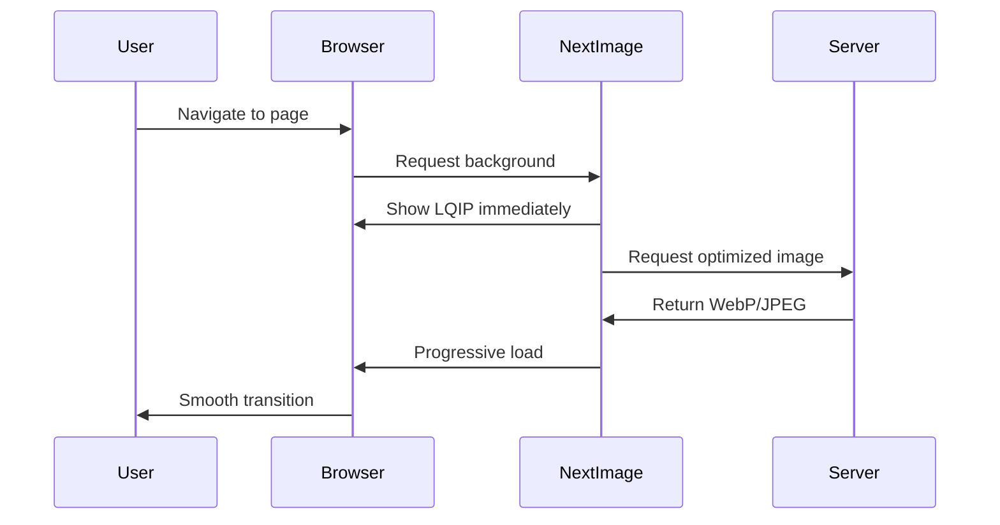

# Design Document

## Overview

Este documento describe el diseño técnico para optimizar las imágenes de fondo en 5 páginas de la aplicación. La solución se basa en aprovechar las capacidades de optimización automática de Next.js Image, crear un componente reutilizable, y aplicar técnicas modernas de carga progresiva para mejorar significativamente los tiempos de carga y la experiencia del usuario.

### Current State

Actualmente, 4 de las 5 páginas usan el patrón `style={{ backgroundImage: 'url(...)' }}` que:
- No optimiza las imágenes automáticamente
- No genera versiones responsive
- No implementa lazy loading
- No proporciona placeholders durante la carga
- Carga imágenes de gran tamaño sin compresión

Solo `/consumables/scan` ya usa `next/image` correctamente, lo cual servirá como referencia para el patrón a seguir.

### Goals

1. Reducir el tiempo de carga inicial (LCP) en al menos 40%
2. Reducir el tamaño de transferencia de imágenes en al menos 60%
3. Implementar carga progresiva con placeholders blur-up
4. Crear un componente reutilizable y consistente
5. Mantener la compatibilidad con navegadores modernos

## Architecture

### Component Structure

```
src/
├── components/
│   └── ui/
│       └── OptimizedBackgroundImage.tsx  (Nuevo componente reutilizable)
├── app/
│   ├── login/page.tsx                     (Refactorizar)
│   ├── tools/
│   │   ├── scan/page.tsx                  (Refactorizar)
│   │   └── return/page.tsx                (Refactorizar)
│   └── consumables/
│       ├── scan/page.tsx                  (Ya optimizado - referencia)
│       └── return/page.tsx                (Refactorizar)
└── public/
    └── images/
        ├── login-background.jpg           (Optimizar)
        ├── solicitar-herramientas-background.jpg  (Optimizar)
        ├── Devoluciones-background.jpg    (Optimizar)
        └── solicitar-materiales-background.jpg    (Optimizar)
```

### Image Optimization Pipeline



### Loading Strategy



## Components and Interfaces

### OptimizedBackgroundImage Component

Este componente encapsula toda la lógica de optimización y proporciona una API simple para las páginas.

```typescript
// src/components/ui/OptimizedBackgroundImage.tsx

import Image from 'next/image'
import { ReactNode } from 'react'

interface OptimizedBackgroundImageProps {
  /** Ruta de la imagen en /public */
  src: string
  /** Texto alternativo para accesibilidad */
  alt: string
  /** Contenido a renderizar sobre la imagen */
  children: ReactNode
  /** Si la imagen debe cargarse con prioridad (para LCP) */
  priority?: boolean
  /** Opacidad del overlay oscuro (0-1) */
  overlayOpacity?: number
  /** Opacidad del overlay en dark mode (0-1) */
  darkOverlayOpacity?: number
  /** Clases adicionales para el contenedor */
  className?: string
  /** Calidad de la imagen (1-100) */
  quality?: number
}

export function OptimizedBackgroundImage({
  src,
  alt,
  children,
  priority = false,
  overlayOpacity = 0.2,
  darkOverlayOpacity = 0.4,
  className = '',
  quality = 85,
}: OptimizedBackgroundImageProps) {
  return (
    <div className={`relative min-h-screen ${className}`}>
      {/* Background Image Layer */}
      <div className="fixed inset-0 z-0">
        <Image
          src={src}
          alt={alt}
          fill
          priority={priority}
          quality={quality}
          sizes="100vw"
          className="object-cover"
          placeholder="blur"
          blurDataURL={generateBlurDataURL(src)}
        />
        {/* Overlay for contrast */}
        <div 
          className="absolute inset-0"
          style={{
            backgroundColor: `rgba(0, 0, 0, ${overlayOpacity})`,
          }}
        />
        <div 
          className="absolute inset-0 dark:block hidden"
          style={{
            backgroundColor: `rgba(0, 0, 0, ${darkOverlayOpacity})`,
          }}
        />
      </div>

      {/* Content Layer */}
      <div className="relative z-10">
        {children}
      </div>
    </div>
  )
}

// Helper para generar blur placeholder
function generateBlurDataURL(src: string): string {
  // Next.js puede generar esto automáticamente en build time
  // o podemos usar una imagen blur pre-generada
  return `data:image/svg+xml;base64,${toBase64(shimmer(700, 475))}`
}

function shimmer(w: number, h: number): string {
  return `
    <svg width="${w}" height="${h}" version="1.1" xmlns="http://www.w3.org/2000/svg" xmlns:xlink="http://www.w3.org/1999/xlink">
      <defs>
        <linearGradient id="g">
          <stop stop-color="#f3f4f6" offset="20%" />
          <stop stop-color="#e5e7eb" offset="50%" />
          <stop stop-color="#f3f4f6" offset="70%" />
        </linearGradient>
      </defs>
      <rect width="${w}" height="${h}" fill="#f3f4f6" />
      <rect id="r" width="${w}" height="${h}" fill="url(#g)" />
      <animate xlink:href="#r" attributeName="x" from="-${w}" to="${w}" dur="1s" repeatCount="indefinite"  />
    </svg>
  `
}

function toBase64(str: string): string {
  return typeof window === 'undefined'
    ? Buffer.from(str).toString('base64')
    : window.btoa(str)
}
```

### Page Integration Pattern

Patrón de uso en las páginas:

```typescript
// Ejemplo: src/app/login/page.tsx

import { OptimizedBackgroundImage } from '@/components/ui/OptimizedBackgroundImage'

export default function LoginPage() {
  return (
    <OptimizedBackgroundImage
      src="/images/login-background.jpg"
      alt="Login background"
      priority={true}  // Login es crítico para LCP
      overlayOpacity={0.2}
      darkOverlayOpacity={0.4}
    >
      <div className="min-h-screen flex items-center justify-center py-12 px-4 sm:px-6 lg:px-8">
        <div className="max-w-md w-full">
          {/* Contenido del formulario */}
        </div>
      </div>
    </OptimizedBackgroundImage>
  )
}
```

## Data Models

### Image Configuration

```typescript
// src/types/images.ts

export interface BackgroundImageConfig {
  /** Ruta de la imagen */
  src: string
  /** Texto alternativo */
  alt: string
  /** Prioridad de carga */
  priority: boolean
  /** Calidad de compresión */
  quality: number
  /** Opacidad del overlay */
  overlayOpacity: number
  /** Opacidad del overlay en dark mode */
  darkOverlayOpacity: number
}

export const BACKGROUND_IMAGES: Record<string, BackgroundImageConfig> = {
  login: {
    src: '/images/login-background.jpg',
    alt: 'Login background',
    priority: true,
    quality: 85,
    overlayOpacity: 0.2,
    darkOverlayOpacity: 0.4,
  },
  toolsScan: {
    src: '/images/solicitar-herramientas-background.jpg',
    alt: 'Solicitar herramientas background',
    priority: false,
    quality: 80,
    overlayOpacity: 0.2,
    darkOverlayOpacity: 0.4,
  },
  toolsReturn: {
    src: '/images/Devoluciones-background.jpg',
    alt: 'Devoluciones background',
    priority: false,
    quality: 80,
    overlayOpacity: 0.2,
    darkOverlayOpacity: 0.4,
  },
  consumablesScan: {
    src: '/images/solicitar-materiales-background.jpg',
    alt: 'Solicitar materiales background',
    priority: false,
    quality: 80,
    overlayOpacity: 0.4,
    darkOverlayOpacity: 0.5,
  },
  consumablesReturn: {
    src: '/images/solicitar-materiales-background.jpg',
    alt: 'Devolución de materiales background',
    priority: false,
    quality: 80,
    overlayOpacity: 0.03,
    darkOverlayOpacity: 0.02,
  },
}
```

## Next.js Configuration

### Image Optimization Settings

```typescript
// next.config.ts

import type { NextConfig } from "next";

const nextConfig: NextConfig = {
  eslint: {
    ignoreDuringBuilds: true,
  },
  typescript: {
    ignoreBuildErrors: true,
  },
  images: {
    formats: ['image/webp', 'image/avif'],
    deviceSizes: [640, 750, 828, 1080, 1200, 1920, 2048, 3840],
    imageSizes: [16, 32, 48, 64, 96, 128, 256, 384],
    minimumCacheTTL: 31536000, // 1 año
    dangerouslyAllowSVG: true,
    contentDispositionType: 'attachment',
    contentSecurityPolicy: "default-src 'self'; script-src 'none'; sandbox;",
  },
};

export default nextConfig;
```

### Responsive Image Sizes

Para cada página, configuraremos `sizes` apropiados:

```typescript
// Móvil: 100vw (pantalla completa)
// Tablet: 100vw (pantalla completa)
// Desktop: 100vw (pantalla completa)
sizes="100vw"
```

## Error Handling

### Fallback Strategy

```typescript
// src/components/ui/OptimizedBackgroundImage.tsx

export function OptimizedBackgroundImage({ ... }) {
  const [imageError, setImageError] = useState(false)

  if (imageError) {
    // Fallback a gradiente si la imagen falla
    return (
      <div className={`relative min-h-screen bg-gradient-to-br from-red-400 via-purple-400 to-blue-500 ${className}`}>
        <div className="relative z-10">
          {children}
        </div>
      </div>
    )
  }

  return (
    <div className={`relative min-h-screen ${className}`}>
      <div className="fixed inset-0 z-0">
        <Image
          src={src}
          alt={alt}
          fill
          priority={priority}
          quality={quality}
          sizes="100vw"
          className="object-cover"
          onError={() => setImageError(true)}
        />
        {/* Overlays */}
      </div>
      <div className="relative z-10">
        {children}
      </div>
    </div>
  )
}
```

### Error States

1. **Image Load Failure**: Mostrar gradiente de respaldo
2. **Slow Connection**: Mostrar placeholder blur mientras carga
3. **Browser Incompatibility**: Next.js maneja automáticamente fallback a JPEG

## Testing Strategy

### Performance Testing

```typescript
// tests/performance/background-images.test.ts

describe('Background Image Optimization', () => {
  it('should load login page with LCP < 2.5s', async () => {
    const metrics = await measurePageLoad('/login')
    expect(metrics.lcp).toBeLessThan(2500)
  })

  it('should reduce image transfer size by 60%', async () => {
    const originalSize = await getImageSize('/images/login-background.jpg')
    const optimizedSize = await getOptimizedImageSize('/login')
    const reduction = ((originalSize - optimizedSize) / originalSize) * 100
    expect(reduction).toBeGreaterThanOrEqual(60)
  })

  it('should serve WebP to supporting browsers', async () => {
    const response = await fetch('/_next/image?url=/images/login-background.jpg&w=1920&q=85')
    expect(response.headers.get('content-type')).toContain('image/webp')
  })
})
```

### Visual Regression Testing

```typescript
// tests/visual/background-images.test.ts

describe('Background Image Visual Tests', () => {
  it('should match login page snapshot', async () => {
    await page.goto('/login')
    await page.waitForLoadState('networkidle')
    expect(await page.screenshot()).toMatchSnapshot('login-page.png')
  })

  it('should show placeholder before image loads', async () => {
    await page.goto('/login', { waitUntil: 'domcontentloaded' })
    const hasPlaceholder = await page.locator('[data-placeholder="blur"]').isVisible()
    expect(hasPlaceholder).toBe(true)
  })
})
```

### Manual Testing Checklist

1. **Desktop (Chrome, Firefox, Safari)**
   - Verificar carga progresiva
   - Verificar transición suave de placeholder a imagen
   - Verificar overlay de contraste
   - Verificar modo oscuro

2. **Mobile (iOS Safari, Chrome Android)**
   - Verificar carga en 3G simulado
   - Verificar responsive images
   - Verificar que no hay layout shift

3. **Network Throttling**
   - Fast 3G: < 3s carga completa
   - Slow 3G: placeholder visible inmediatamente

4. **Browser DevTools**
   - Verificar formato WebP en Network tab
   - Verificar cache headers
   - Verificar tamaño de transferencia

## Implementation Phases

### Phase 1: Setup and Component Creation
- Crear componente `OptimizedBackgroundImage`
- Configurar Next.js image optimization
- Crear tipos y configuraciones

### Phase 2: Page Migration
- Migrar `/login` (priority=true)
- Migrar `/tools/scan`
- Migrar `/tools/return`
- Refactorizar `/consumables/scan` para usar componente
- Migrar `/consumables/return`

### Phase 3: Testing and Validation
- Ejecutar Lighthouse en todas las páginas
- Medir métricas before/after
- Validar en múltiples dispositivos y navegadores
- Ajustar calidad y configuraciones según resultados

### Phase 4: Optimization Tuning
- Ajustar calidades de imagen según página
- Optimizar overlays para mejor contraste
- Implementar mejoras adicionales basadas en métricas

## Performance Targets

| Métrica | Antes | Después | Mejora |
|---------|-------|---------|--------|
| LCP | ~4.5s | <2.5s | 44% |
| Image Size | ~2MB | <800KB | 60% |
| Lighthouse Performance | ~65 | >80 | +15 |
| First Contentful Paint | ~2s | <1s | 50% |
| Time to Interactive | ~5s | <3s | 40% |

## Browser Compatibility

- Chrome 90+ ✅
- Firefox 88+ ✅
- Safari 14+ ✅
- Edge 90+ ✅
- Mobile Safari 14+ ✅
- Chrome Android 90+ ✅

Next.js Image automáticamente maneja:
- WebP fallback a JPEG
- AVIF para navegadores que lo soporten
- Responsive images con srcset
- Lazy loading nativo

## Security Considerations

1. **Content Security Policy**: Configurar CSP apropiado para imágenes
2. **Image Domains**: Solo permitir imágenes del dominio propio
3. **SVG Sanitization**: Si se usan SVGs, sanitizar apropiadamente
4. **Cache Headers**: Configurar headers seguros para prevenir cache poisoning

## Accessibility

1. **Alt Text**: Todas las imágenes tienen alt descriptivo
2. **Contrast**: Overlays aseguran contraste suficiente para texto
3. **Loading States**: Placeholders no causan confusión
4. **Keyboard Navigation**: No afecta la navegación por teclado
5. **Screen Readers**: Imágenes decorativas marcadas apropiadamente

## Monitoring and Metrics

### Real User Monitoring (RUM)

```typescript
// src/lib/performance.ts

export function reportWebVitals(metric: NextWebVitalsMetric) {
  if (metric.label === 'web-vital') {
    // Enviar a analytics
    console.log(metric)
    
    // Alertar si LCP > 2.5s
    if (metric.name === 'LCP' && metric.value > 2500) {
      console.warn('LCP is above threshold:', metric.value)
    }
  }
}
```

### Lighthouse CI Integration

```yaml
# .github/workflows/lighthouse.yml
name: Lighthouse CI
on: [pull_request]
jobs:
  lighthouse:
    runs-on: ubuntu-latest
    steps:
      - uses: actions/checkout@v2
      - name: Run Lighthouse
        uses: treosh/lighthouse-ci-action@v9
        with:
          urls: |
            http://localhost:3000/login
            http://localhost:3000/tools/scan
          uploadArtifacts: true
```

## Future Enhancements

1. **Progressive JPEG**: Implementar JPEG progresivo para mejor UX
2. **Blur Hash**: Usar blurhash para placeholders más precisos
3. **Art Direction**: Diferentes imágenes para móvil vs desktop
4. **Preload Critical Images**: Preload de login background
5. **Service Worker Caching**: Cache de imágenes en service worker para PWA
