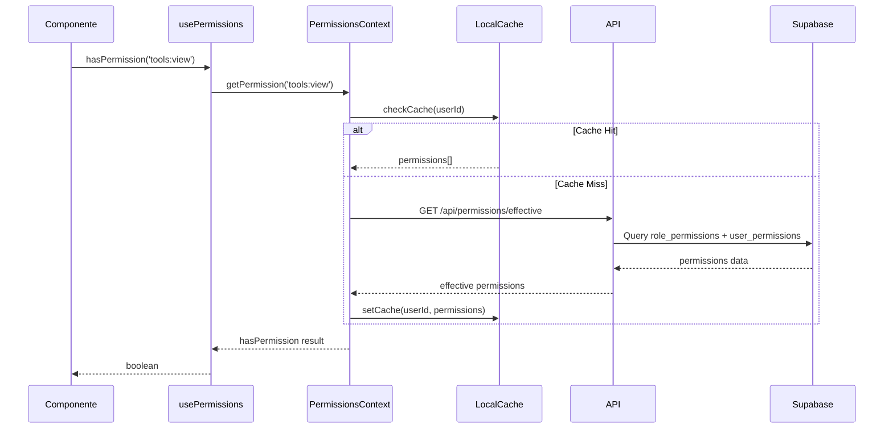

# Documento de Diseño Técnico

## Descripción General

El Sistema de Gestión de Permisos Dinámico reemplaza el sistema de permisos hardcodeado actual por una solución basada en base de datos que permite crear roles personalizados, asignar permisos granulares y gestionar accesos desde una interfaz administrativa. El diseño mantiene compatibilidad con el código existente mientras añade flexibilidad para configuración dinámica.

### Principios de Diseño

1. **Compatibilidad hacia atrás**: Las funciones y componentes existentes (hasPermission, PermissionGuard, usePermissions) seguirán funcionando sin cambios
2. **Separación de responsabilidades**: Lógica de permisos en servicios, UI en componentes, persistencia en Supabase
3. **Rendimiento**: Caché en cliente para evitar consultas repetidas, índices optimizados en BD
4. **Seguridad en capas**: Validación en frontend (UX) y backend (seguridad real)
5. **Auditoría completa**: Todo cambio en permisos queda registrado

## Arquitectura

```mermaid
graph TB
    subgraph "Frontend (Next.js)"
        UI[Página Admin Permisos]
        PG[PermissionGuard]
        RG[RoleGuard]
        UP[usePermissions Hook]
        PC[PermissionsContext]
    end
    
    subgraph "API Layer"
        AR[/api/admin/roles]
        AP[/api/admin/permissions]
        AU[/api/admin/user-permissions]
        AS[/api/admin/sections]
    end
    
    subgraph "Services"
        PS[PermissionsService]
        RS[RolesService]
        CS[CacheService]
        AUS[AuditService]
    end
    
    subgraph "Database (Supabase)"
        RT[(roles)]
        RPT[(role_permissions)]
        UPT[(user_permissions)]
        ST[(sections)]
        PAT[(permissions_audit)]
    end
    
    UI --> AR
    UI --> AP
    UI --> AU
    UI --> AS
    
    PG --> UP
    RG --> UP
    UP --> PC
    PC --> PS
    
    AR --> RS
    AP --> PS
    AU --> PS
    AS --> PS
    
    RS --> RT
    PS --> RPT
    PS --> UPT
    PS --> ST
    PS --> CS
    PS --> AUS
    AUS --> PAT
```

### Flujo de Verificación de Permisos



## Componentes e Interfaces

### Servicios de Backend

#### PermissionsService

```typescript
// src/services/permissions.service.ts

interface EffectivePermissions {
  rolePermissions: string[];      // Permisos heredados del rol
  userGranted: string[];          // Permisos adicionales del usuario
  userRevoked: string[];          // Permisos revocados del usuario
  effective: string[];            // Permisos finales calculados
}

interface PermissionsService {
  // Consultas
  getEffectivePermissions(userId: number): Promise<EffectivePermissions>;
  getRolePermissions(roleId: number): Promise<string[]>;
  getUserOverrides(userId: number): Promise<{ granted: string[]; revoked: string[] }>;
  
  // Modificaciones de rol
  setRolePermissions(roleId: number, permissions: string[], adminId: number): Promise<void>;
  addRolePermission(roleId: number, permission: string, adminId: number): Promise<void>;
  removeRolePermission(roleId: number, permission: string, adminId: number): Promise<void>;
  
  // Modificaciones de usuario
  grantUserPermission(userId: number, permission: string, adminId: number): Promise<void>;
  revokeUserPermission(userId: number, permission: string, adminId: number): Promise<void>;
  clearUserOverrides(userId: number, adminId: number): Promise<void>;
  
  // Validación
  hasPermission(userId: number, permission: string): Promise<boolean>;
  hasAnyPermission(userId: number, permissions: string[]): Promise<boolean>;
  hasAllPermissions(userId: number, permissions: string[]): Promise<boolean>;
  
  // Caché
  invalidateUserCache(userId: number): void;
  invalidateRoleCache(roleId: number): void;
}
```

#### RolesService

```typescript
// src/services/roles.service.ts

interface Role {
  id: number;
  name: string;
  description: string | null;
  isProtected: boolean;
  userCount: number;
  createdAt: Date;
  updatedAt: Date;
}

interface CreateRoleInput {
  name: string;
  description?: string;
  permissions?: string[];
}

interface UpdateRoleInput {
  name?: string;
  description?: string;
}

interface RolesService {
  // CRUD
  getAllRoles(): Promise<Role[]>;
  getRoleById(id: number): Promise<Role | null>;
  getRoleByName(name: string): Promise<Role | null>;
  createRole(input: CreateRoleInput, adminId: number): Promise<Role>;
  updateRole(id: number, input: UpdateRoleInput, adminId: number): Promise<Role>;
  deleteRole(id: number, adminId: number): Promise<void>;
  
  // Asignación de usuarios
  assignUserToRole(userId: number, roleId: number, adminId: number): Promise<void>;
  getUsersByRole(roleId: number): Promise<User[]>;
  
  // Validación
  isProtectedRole(roleId: number): boolean;
  canDeleteRole(roleId: number): Promise<{ canDelete: boolean; reason?: string; affectedUsers?: number }>;
}
```

### Componentes de Frontend

#### PermissionsContext

```typescript
// src/contexts/PermissionsContext.tsx

interface PermissionsContextValue {
  // Estado
  permissions: string[];
  rolePermissions: string[];
  userOverrides: { granted: string[]; revoked: string[] };
  isLoading: boolean;
  error: Error | null;
  
  // Verificación
  hasPermission: (permission: string) => boolean;
  hasAnyPermission: (permissions: string[]) => boolean;
  hasAllPermissions: (permissions: string[]) => boolean;
  
  // Acciones
  refreshPermissions: () => Promise<void>;
  
  // Metadata
  userRole: string;
  isAdmin: boolean;
}
```

#### Componentes de UI para Admin

```typescript
// src/components/admin/permissions/RolesTab.tsx
interface RolesTabProps {
  roles: Role[];
  selectedRole: Role | null;
  onSelectRole: (role: Role) => void;
  onCreateRole: (input: CreateRoleInput) => Promise<void>;
  onUpdateRole: (id: number, input: UpdateRoleInput) => Promise<void>;
  onDeleteRole: (id: number) => Promise<void>;
}

// src/components/admin/permissions/PermissionsMatrix.tsx
interface PermissionsMatrixProps {
  permissions: PermissionDefinition[];
  selectedPermissions: string[];
  inheritedPermissions?: string[];
  revokedPermissions?: string[];
  onChange: (permission: string, enabled: boolean) => void;
  disabled?: boolean;
  showInheritance?: boolean;
}

// src/components/admin/permissions/UsersTab.tsx
interface UsersTabProps {
  users: UserWithPermissions[];
  selectedUser: UserWithPermissions | null;
  onSelectUser: (user: UserWithPermissions) => void;
  onUpdateUserPermissions: (userId: number, granted: string[], revoked: string[]) => Promise<void>;
  searchQuery: string;
  onSearchChange: (query: string) => void;
}

// src/components/admin/permissions/SectionsTab.tsx
interface SectionsTabProps {
  sections: Section[];
  rolePermissions: Record<number, string[]>;
  onUpdateSectionAccess: (roleId: number, sectionId: number, hasAccess: boolean) => Promise<void>;
}
```

### API Routes

```typescript
// Roles API
// GET    /api/admin/roles              - Listar todos los roles
// POST   /api/admin/roles              - Crear nuevo rol
// GET    /api/admin/roles/[id]         - Obtener rol por ID
// PUT    /api/admin/roles/[id]         - Actualizar rol
// DELETE /api/admin/roles/[id]         - Eliminar rol
// GET    /api/admin/roles/[id]/permissions - Obtener permisos del rol
// PUT    /api/admin/roles/[id]/permissions - Actualizar permisos del rol

// User Permissions API
// GET    /api/admin/users/[id]/permissions - Obtener permisos efectivos del usuario
// PUT    /api/admin/users/[id]/permissions - Actualizar overrides del usuario

// Sections API
// GET    /api/admin/sections           - Listar secciones del sistema
// PUT    /api/admin/sections/[id]/access - Actualizar acceso a sección

// Current User Permissions
// GET    /api/permissions/effective    - Obtener permisos del usuario actual

// Audit API
// GET    /api/admin/permissions/audit  - Obtener historial de cambios
```

## Modelos de Datos

### Esquema de Base de Datos

```sql
-- Tabla de roles personalizados
CREATE TABLE roles (
  id SERIAL PRIMARY KEY,
  name VARCHAR(50) UNIQUE NOT NULL,
  description TEXT,
  is_protected BOOLEAN DEFAULT FALSE,
  created_at TIMESTAMP DEFAULT CURRENT_TIMESTAMP,
  updated_at TIMESTAMP DEFAULT CURRENT_TIMESTAMP
);

-- Tabla de permisos por rol
CREATE TABLE role_permissions (
  id SERIAL PRIMARY KEY,
  role_id INTEGER REFERENCES roles(id) ON DELETE CASCADE,
  permission VARCHAR(100) NOT NULL,
  created_at TIMESTAMP DEFAULT CURRENT_TIMESTAMP,
  UNIQUE(role_id, permission)
);

-- Tabla de permisos específicos de usuario (overrides)
CREATE TABLE user_permissions (
  id SERIAL PRIMARY KEY,
  user_id INTEGER REFERENCES users(id) ON DELETE CASCADE,
  permission VARCHAR(100) NOT NULL,
  is_granted BOOLEAN NOT NULL, -- true = otorgado, false = revocado
  created_at TIMESTAMP DEFAULT CURRENT_TIMESTAMP,
  updated_at TIMESTAMP DEFAULT CURRENT_TIMESTAMP,
  UNIQUE(user_id, permission)
);

-- Tabla de secciones del sistema
CREATE TABLE sections (
  id SERIAL PRIMARY KEY,
  name VARCHAR(100) NOT NULL,
  path VARCHAR(200) UNIQUE NOT NULL,
  description TEXT,
  required_permission VARCHAR(100) NOT NULL,
  parent_section_id INTEGER REFERENCES sections(id),
  display_order INTEGER DEFAULT 0,
  is_admin_section BOOLEAN DEFAULT FALSE,
  created_at TIMESTAMP DEFAULT CURRENT_TIMESTAMP
);

-- Tabla de auditoría de permisos
CREATE TABLE permissions_audit (
  id SERIAL PRIMARY KEY,
  admin_user_id INTEGER REFERENCES users(id) ON DELETE SET NULL,
  action_type VARCHAR(50) NOT NULL, -- 'role_created', 'role_updated', 'role_deleted', 'role_permissions_changed', 'user_permissions_changed'
  target_type VARCHAR(20) NOT NULL, -- 'role' o 'user'
  target_id INTEGER NOT NULL,
  target_name VARCHAR(100),
  changes JSONB NOT NULL, -- { added: [], removed: [], before: {}, after: {} }
  ip_address INET,
  user_agent TEXT,
  created_at TIMESTAMP DEFAULT CURRENT_TIMESTAMP
);

-- Modificar tabla users para usar role_id en lugar de role string
ALTER TABLE users 
  ADD COLUMN role_id INTEGER REFERENCES roles(id);

-- Índices para optimización
CREATE INDEX idx_role_permissions_role_id ON role_permissions(role_id);
CREATE INDEX idx_role_permissions_permission ON role_permissions(permission);
CREATE INDEX idx_user_permissions_user_id ON user_permissions(user_id);
CREATE INDEX idx_user_permissions_permission ON user_permissions(permission);
CREATE INDEX idx_sections_path ON sections(path);
CREATE INDEX idx_sections_required_permission ON sections(required_permission);
CREATE INDEX idx_permissions_audit_target ON permissions_audit(target_type, target_id);
CREATE INDEX idx_permissions_audit_admin ON permissions_audit(admin_user_id);
CREATE INDEX idx_permissions_audit_created ON permissions_audit(created_at DESC);
CREATE INDEX idx_users_role_id ON users(role_id);
```

### Tipos TypeScript

```typescript
// src/types/permissions.ts

export interface Role {
  id: number;
  name: string;
  description: string | null;
  isProtected: boolean;
  createdAt: Date;
  updatedAt: Date;
}

export interface RoleWithPermissions extends Role {
  permissions: string[];
  userCount: number;
}

export interface UserPermissionOverride {
  id: number;
  userId: number;
  permission: string;
  isGranted: boolean;
  createdAt: Date;
  updatedAt: Date;
}

export interface Section {
  id: number;
  name: string;
  path: string;
  description: string | null;
  requiredPermission: string;
  parentSectionId: number | null;
  displayOrder: number;
  isAdminSection: boolean;
}

export interface PermissionAuditEntry {
  id: number;
  adminUserId: number | null;
  adminUsername?: string;
  actionType: 'role_created' | 'role_updated' | 'role_deleted' | 'role_permissions_changed' | 'user_permissions_changed';
  targetType: 'role' | 'user';
  targetId: number;
  targetName: string;
  changes: {
    added?: string[];
    removed?: string[];
    before?: Record<string, unknown>;
    after?: Record<string, unknown>;
  };
  ipAddress: string | null;
  userAgent: string | null;
  createdAt: Date;
}

export interface EffectivePermissions {
  roleId: number;
  roleName: string;
  rolePermissions: string[];
  userGranted: string[];
  userRevoked: string[];
  effective: string[];
}

export interface PermissionDefinition {
  key: string;
  name: string;
  description: string;
  category: PermissionCategory;
}

export type PermissionCategory = 
  | 'tools'
  | 'loans'
  | 'consumables'
  | 'admin'
  | 'users'
  | 'notifications'
  | 'audit'
  | 'reports'
  | 'system';

export interface UserWithPermissions {
  id: number;
  username: string;
  email: string;
  fullName: string | null;
  roleId: number;
  roleName: string;
  effectivePermissions: string[];
  overrides: {
    granted: string[];
    revoked: string[];
  };
}
```

### Datos Iniciales (Seed)

```typescript
// Roles iniciales
const INITIAL_ROLES = [
  { name: 'admin', description: 'Administrador del sistema', isProtected: true },
  { name: 'user', description: 'Usuario estándar', isProtected: true },
];

// Secciones del sistema
const INITIAL_SECTIONS = [
  { name: 'Dashboard', path: '/dashboard', requiredPermission: 'sections:dashboard', isAdminSection: false },
  { name: 'Herramientas', path: '/tools', requiredPermission: 'sections:tools', isAdminSection: false },
  { name: 'Consumibles', path: '/consumables', requiredPermission: 'sections:consumables', isAdminSection: false },
  { name: 'Mis Préstamos', path: '/my-loans', requiredPermission: 'sections:my_loans', isAdminSection: false },
  { name: 'Mis Espacios', path: '/my-spaces', requiredPermission: 'sections:my_spaces', isAdminSection: false },
  { name: 'Perfil', path: '/profile', requiredPermission: 'sections:profile', isAdminSection: false },
  { name: 'Admin Dashboard', path: '/admin/dashboard', requiredPermission: 'admin:view_dashboard', isAdminSection: true },
  { name: 'Admin Herramientas', path: '/admin/tools', requiredPermission: 'admin:manage_tools', isAdminSection: true },
  { name: 'Admin Consumibles', path: '/admin/consumables', requiredPermission: 'admin:manage_consumables', isAdminSection: true },
  { name: 'Admin Electrónicos', path: '/admin/electronics', requiredPermission: 'admin:manage_electronics', isAdminSection: true },
  { name: 'Admin Aulas', path: '/admin/classrooms', requiredPermission: 'admin:manage_classrooms', isAdminSection: true },
  { name: 'Admin Asignaciones', path: '/admin/assignments', requiredPermission: 'admin:manage_assignments', isAdminSection: true },
  { name: 'Admin Usuarios', path: '/admin/users', requiredPermission: 'users:manage', isAdminSection: true },
  { name: 'Admin Categorías', path: '/admin/categories', requiredPermission: 'admin:manage_categories', isAdminSection: true },
  { name: 'Admin Reportes', path: '/admin/reports', requiredPermission: 'reports:view', isAdminSection: true },
  { name: 'Admin Auditoría', path: '/admin/audit', requiredPermission: 'audit:view', isAdminSection: true },
  { name: 'Admin Permisos', path: '/admin/permissions', requiredPermission: 'admin:manage_permissions', isAdminSection: true },
];
```


## Propiedades de Correctitud

*Una propiedad es una característica o comportamiento que debe mantenerse verdadero en todas las ejecuciones válidas del sistema. Las propiedades sirven como puente entre especificaciones legibles por humanos y garantías de correctitud verificables por máquinas.*

### Property 1: Unicidad de nombres de roles

*Para cualquier* nombre de rol válido (no vacío, no solo espacios), si se crea un rol con ese nombre exitosamente, intentar crear otro rol con el mismo nombre debe resultar en un error de duplicado.

**Validates: Requirements 1.2, 1.3**

### Property 2: Edición de roles preserva permisos

*Para cualquier* rol existente con un conjunto de permisos asignados, actualizar el nombre o descripción del rol debe resultar en que los permisos del rol permanezcan exactamente iguales antes y después de la operación.

**Validates: Requirements 1.4**

### Property 3: Eliminación de roles reasigna usuarios

*Para cualquier* rol no protegido con usuarios asignados, al eliminar el rol, todos los usuarios que tenían ese rol deben ser reasignados al rol "user" por defecto.

**Validates: Requirements 1.6**

### Property 4: Consistencia de permisos de rol

*Para cualquier* rol y conjunto de permisos, después de asignar permisos al rol, consultar los permisos del rol debe devolver exactamente el mismo conjunto de permisos asignados.

**Validates: Requirements 2.2, 2.5**

### Property 5: Auditoría de operaciones de permisos

*Para cualquier* operación que modifique roles o permisos (crear rol, eliminar rol, cambiar permisos de rol, cambiar permisos de usuario), debe existir un registro de auditoría correspondiente con el admin que realizó la acción, el objetivo afectado y los cambios realizados.

**Validates: Requirements 2.3, 3.4, 6.1, 6.2, 6.3**

### Property 6: Override de permisos - Grant

*Para cualquier* usuario y permiso que no está incluido en su rol, al agregar un override de tipo "granted", el usuario debe tener ese permiso en sus permisos efectivos.

**Validates: Requirements 3.2**

### Property 7: Override de permisos - Revoke

*Para cualquier* usuario y permiso que está incluido en su rol, al agregar un override de tipo "revoked", el usuario NO debe tener ese permiso en sus permisos efectivos.

**Validates: Requirements 3.3**

### Property 8: Cálculo de permisos efectivos

*Para cualquier* usuario con un rol y un conjunto de overrides, los permisos efectivos deben ser: (permisos del rol - permisos revocados) + permisos otorgados. Esta fórmula debe producir resultados consistentes.

**Validates: Requirements 3.5**

### Property 9: Control de acceso a secciones

*Para cualquier* usuario y sección del sistema, si el usuario no tiene el permiso requerido por la sección, el acceso a la API de esa sección debe retornar código 403.

**Validates: Requirements 4.2, 4.4**

### Property 10: Filtrado de navegación

*Para cualquier* usuario, las secciones retornadas por la API de navegación deben ser exactamente aquellas para las cuales el usuario tiene el permiso requerido.

**Validates: Requirements 4.3**

### Property 11: Búsqueda de usuarios y roles

*Para cualquier* query de búsqueda, los resultados de búsqueda de usuarios deben contener solo usuarios cuyo nombre, email o username contenga el query. Los resultados de búsqueda de roles deben contener solo roles cuyo nombre contenga el query.

**Validates: Requirements 5.2, 5.3**

### Property 12: Ordenamiento de auditoría

*Para cualquier* consulta al historial de auditoría, los registros deben estar ordenados por fecha de creación en orden descendente (más reciente primero).

**Validates: Requirements 6.4**

### Property 13: Inmutabilidad de auditoría

*Para cualquier* registro de auditoría existente, no debe ser posible modificar ni eliminar el registro a través de la API.

**Validates: Requirements 6.5**

### Property 14: Autenticación requerida

*Para cualquier* request a las APIs de permisos sin token de autenticación válido, la respuesta debe ser código 401.

**Validates: Requirements 7.2**

### Property 15: Autorización de administrador requerida

*Para cualquier* request de modificación a las APIs de permisos desde un usuario sin rol de administrador, la respuesta debe ser código 403.

**Validates: Requirements 7.3**

### Property 16: Compatibilidad con sistema anterior

*Para cualquier* usuario y permiso, las funciones hasPermission, hasAnyPermission y hasAllPermissions del nuevo sistema deben producir los mismos resultados que el sistema anterior cuando se usan los mismos datos de entrada.

**Validates: Requirements 8.1, 8.2, 8.4, 8.5**

### Property 17: Invalidación de caché

*Para cualquier* cambio en los permisos de un usuario (directo o a través de su rol), después de la invalidación del caché, la siguiente consulta de permisos debe reflejar los cambios realizados.

**Validates: Requirements 9.3**

## Manejo de Errores

### Errores de Validación

| Código | Mensaje | Causa | Acción |
|--------|---------|-------|--------|
| `ROLE_NAME_REQUIRED` | El nombre del rol es requerido | Nombre vacío o solo espacios | Mostrar error en campo |
| `ROLE_NAME_EXISTS` | Ya existe un rol con este nombre | Nombre duplicado | Mostrar error, sugerir otro nombre |
| `ROLE_NAME_TOO_LONG` | El nombre del rol es muy largo | Más de 50 caracteres | Mostrar error con límite |
| `PROTECTED_ROLE` | No se puede modificar/eliminar un rol protegido | Intentar modificar admin/user | Mostrar mensaje informativo |
| `CRITICAL_PERMISSION` | No se puede quitar este permiso del rol admin | Quitar SYSTEM_CONFIGURE, etc. | Mostrar mensaje de protección |
| `SELF_PERMISSION_REMOVAL` | No puedes quitarte el permiso de gestionar permisos | Admin quitándose permiso | Mostrar advertencia |

### Errores de Autenticación/Autorización

| Código HTTP | Código | Mensaje | Acción |
|-------------|--------|---------|--------|
| 401 | `UNAUTHORIZED` | Sesión expirada o inválida | Redirigir a login |
| 403 | `FORBIDDEN` | No tienes permisos para esta acción | Mostrar mensaje, no redirigir |
| 403 | `ADMIN_REQUIRED` | Se requiere rol de administrador | Mostrar mensaje informativo |

### Errores de Base de Datos

| Código | Mensaje | Causa | Acción |
|--------|---------|-------|--------|
| `DB_CONNECTION_ERROR` | Error de conexión a la base de datos | Supabase no disponible | Reintentar, mostrar error |
| `CONSTRAINT_VIOLATION` | Error de integridad de datos | FK o unique constraint | Log error, mostrar mensaje genérico |
| `TRANSACTION_FAILED` | Error al guardar cambios | Rollback de transacción | Reintentar, mantener datos en UI |

### Estrategia de Recuperación

```typescript
// src/lib/error-handler.ts

interface PermissionError {
  code: string;
  message: string;
  field?: string;
  recoverable: boolean;
}

const handlePermissionError = (error: unknown): PermissionError => {
  if (error instanceof SupabaseError) {
    if (error.code === '23505') { // Unique violation
      return {
        code: 'ROLE_NAME_EXISTS',
        message: 'Ya existe un rol con este nombre',
        field: 'name',
        recoverable: true
      };
    }
  }
  
  // Error genérico
  return {
    code: 'UNKNOWN_ERROR',
    message: 'Ocurrió un error inesperado',
    recoverable: false
  };
};
```

## Estrategia de Testing

### Enfoque Dual de Testing

El sistema utilizará dos enfoques complementarios:

1. **Unit Tests**: Para casos específicos, edge cases y condiciones de error
2. **Property-Based Tests**: Para verificar propiedades universales con inputs generados

### Configuración de Property-Based Testing

- **Librería**: fast-check (ya instalada en el proyecto)
- **Iteraciones mínimas**: 100 por propiedad
- **Formato de tag**: `Feature: dynamic-permissions-system, Property N: [descripción]`

### Unit Tests

Los unit tests cubrirán:

1. **Casos específicos de protección de roles**
   - Intentar eliminar rol "admin" → error
   - Intentar eliminar rol "user" → error
   - Intentar quitar SYSTEM_CONFIGURE de admin → error

2. **Edge cases de validación**
   - Nombre de rol vacío
   - Nombre de rol con solo espacios
   - Nombre de rol con caracteres especiales
   - Descripción muy larga

3. **Casos de migración**
   - Sistema sin datos previos
   - Sistema con usuarios existentes
   - Sistema con roles hardcodeados

4. **Integración de componentes**
   - PermissionGuard con nuevo sistema
   - RoleGuard con nuevo sistema
   - usePermissions hook

### Property-Based Tests

Cada propiedad del diseño tendrá su test correspondiente:

```typescript
// Ejemplo de estructura de test
describe('Feature: dynamic-permissions-system', () => {
  // Property 1: Unicidad de nombres de roles
  it('Property 1: Role names must be unique', () => {
    fc.assert(
      fc.property(
        fc.string({ minLength: 1, maxLength: 50 }).filter(s => s.trim().length > 0),
        async (roleName) => {
          // Crear primer rol
          const role1 = await createRole({ name: roleName });
          expect(role1).toBeDefined();
          
          // Intentar crear segundo rol con mismo nombre
          await expect(createRole({ name: roleName }))
            .rejects.toThrow(/already exists/);
          
          // Cleanup
          await deleteRole(role1.id);
        }
      ),
      { numRuns: 100 }
    );
  });
  
  // Property 8: Cálculo de permisos efectivos
  it('Property 8: Effective permissions calculation', () => {
    fc.assert(
      fc.property(
        fc.array(fc.constantFrom(...ALL_PERMISSIONS)), // rolePermissions
        fc.array(fc.constantFrom(...ALL_PERMISSIONS)), // grantedOverrides
        fc.array(fc.constantFrom(...ALL_PERMISSIONS)), // revokedOverrides
        (rolePerms, granted, revoked) => {
          const effective = calculateEffectivePermissions(rolePerms, granted, revoked);
          
          // Verificar fórmula: (role - revoked) + granted
          const expected = new Set([
            ...rolePerms.filter(p => !revoked.includes(p)),
            ...granted
          ]);
          
          expect(new Set(effective)).toEqual(expected);
        }
      ),
      { numRuns: 100 }
    );
  });
});
```

### Generadores Personalizados

```typescript
// src/tests/generators/permissions.generators.ts

import * as fc from 'fast-check';
import { PERMISSIONS } from '@/lib/permissions';

// Generador de nombres de rol válidos
export const validRoleNameArb = fc.string({ minLength: 1, maxLength: 50 })
  .filter(s => s.trim().length > 0 && !['admin', 'user'].includes(s.toLowerCase()));

// Generador de permisos
export const permissionArb = fc.constantFrom(...Object.values(PERMISSIONS));

// Generador de conjunto de permisos
export const permissionSetArb = fc.uniqueArray(permissionArb, { minLength: 0, maxLength: 10 });

// Generador de override de usuario
export const userOverrideArb = fc.record({
  granted: permissionSetArb,
  revoked: permissionSetArb
});

// Generador de rol completo
export const roleArb = fc.record({
  name: validRoleNameArb,
  description: fc.option(fc.string({ maxLength: 200 })),
  permissions: permissionSetArb
});

// Generador de query de búsqueda
export const searchQueryArb = fc.string({ minLength: 1, maxLength: 50 });
```

### Cobertura de Tests

| Área | Unit Tests | Property Tests |
|------|------------|----------------|
| Gestión de Roles | Protección, validación | Unicidad, CRUD |
| Permisos de Rol | Permisos críticos | Asignación, consistencia |
| Overrides de Usuario | Edge cases | Grant, revoke, cálculo |
| Control de Acceso | Casos específicos | Filtrado, autorización |
| Auditoría | Formato de registros | Inmutabilidad, ordenamiento |
| Seguridad | 401, 403 específicos | Autenticación, autorización |
| Compatibilidad | Migración | Funciones existentes |
| Caché | Invalidación manual | Invalidación automática |

### Ejecución de Tests

```bash
# Ejecutar todos los tests
npm test

# Ejecutar solo tests de permisos
npm test -- --testPathPattern=permissions

# Ejecutar con más iteraciones de PBT
FAST_CHECK_NUM_RUNS=500 npm test
```
