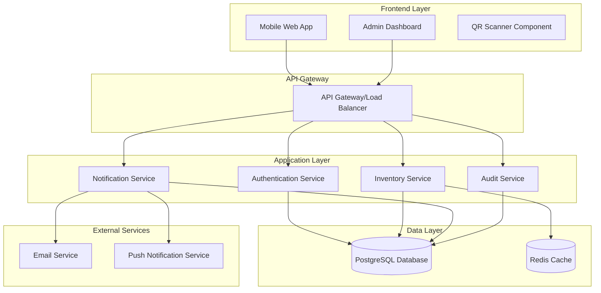

# Design Document

## Overview

The Inventory Management System is designed as a modern web application with a RESTful API backend and responsive frontend interface. The system handles both unique tools (individual tracking) and consumable items (quantity-based) with comprehensive audit trails, real-time notifications, and robust concurrency control.

### Key Design Principles

- **Mobile-first approach**: Primary interface optimized for mobile devices with QR scanning
- **API-driven architecture**: Clean separation between backend services and frontend interfaces
- **Event-driven notifications**: Asynchronous processing for notifications and audit logging
- **Optimistic concurrency control**: Database-level locking with retry mechanisms
- **Modular design**: Separate services for core functionality, notifications, and reporting

## Architecture

### System Architecture



### Technology Stack

- **Backend**: Node.js with Express.js framework
- **Database**: PostgreSQL with connection pooling
- **Cache**: Redis for session management and performance optimization
- **Authentication**: JWT tokens with refresh token rotation
- **Frontend**: Progressive Web App (PWA) with vanilla JavaScript/TypeScript
- **QR Code**: HTML5 camera API with QR code scanning library
- **Notifications**: WebSocket connections for real-time updates

## Components and Interfaces

### Core Services

#### Authentication Service
- **Purpose**: Handle user authentication, authorization, and session management
- **Key Methods**:
  - `POST /api/auth/login` - User authentication
  - `POST /api/auth/refresh` - Token refresh
  - `POST /api/auth/logout` - Session termination
  - `GET /api/auth/profile` - User profile information

#### Inventory Service
- **Purpose**: Manage tools, consumables, loans, and inventory operations
- **Key Methods**:
  - `GET /api/tools/qr/{qr_code}` - Tool lookup by UUID-based QR code
  - `POST /api/loans` - Create new loan
  - `PUT /api/loans/{id}/return` - Process return
  - `GET /api/consumables` - List consumables with stock
  - `POST /api/consumables/request` - Request consumable items
  - `PUT /api/items/{id}/status` - Update item status (admin only)
  - `GET /api/admin/tools/{id}/qr-image` - Generate QR code image on-demand

#### Notification Service
- **Purpose**: Handle all notification processing and delivery
- **Key Methods**:
  - `POST /api/notifications` - Create notification
  - `GET /api/notifications/user/{id}` - Get user notifications
  - `PUT /api/notifications/{id}/read` - Mark notification as read
  - Background job for overdue item detection

#### Audit Service
- **Purpose**: Track all system activities and provide audit trails
- **Key Methods**:
  - `POST /api/audit/log` - Create audit entry (internal)
  - `GET /api/audit/logs` - Query audit logs (admin only)
  - `GET /api/audit/item/{id}` - Item-specific audit history

### Frontend Components

#### QR Scanner Component
```javascript
class QRScanner {
  async startScanning() {
    // Initialize camera stream
    // Process QR codes in real-time
    // Handle scanning errors
  }
  
  async processQRCode(qrData) {
    // Validate UUID format (36 characters with hyphens)
    if (!this.isValidUUID(qrData)) {
      throw new Error('Invalid QR code format');
    }
    
    // Call API with UUID from QR code
    const response = await fetch(`/api/tools/qr/${qrData}`);
    // Display confirmation UI
  }
  
  isValidUUID(uuid) {
    const uuidRegex = /^[0-9a-f]{8}-[0-9a-f]{4}-[1-5][0-9a-f]{3}-[89ab][0-9a-f]{3}-[0-9a-f]{12}$/i;
    return uuidRegex.test(uuid);
  }
}
```

#### Inventory Management Component
```javascript
class InventoryManager {
  async loanTool(toolId, userId) {
    // Optimistic locking implementation
    // Retry logic for concurrency conflicts
    // Audit log creation
  }
  
  async requestConsumable(itemId, quantity, userId) {
    // Stock validation
    // Backorder creation if insufficient stock
    // Notification triggers
  }
}
```

## Data Models

### Database Schema

#### Users Table
```sql
CREATE TABLE users (
  id SERIAL PRIMARY KEY,
  username VARCHAR(50) UNIQUE NOT NULL,
  email VARCHAR(100) UNIQUE NOT NULL,
  password_hash VARCHAR(255) NOT NULL,
  role VARCHAR(20) DEFAULT 'user',
  created_at TIMESTAMP DEFAULT CURRENT_TIMESTAMP,
  updated_at TIMESTAMP DEFAULT CURRENT_TIMESTAMP,
  version INTEGER DEFAULT 1
);
```

#### Item Types Table
```sql
CREATE TABLE item_types (
  id SERIAL PRIMARY KEY,
  name VARCHAR(100) NOT NULL,
  description TEXT,
  category VARCHAR(50),
  is_consumable BOOLEAN DEFAULT FALSE,
  default_loan_duration_days INTEGER DEFAULT 7,
  created_at TIMESTAMP DEFAULT CURRENT_TIMESTAMP,
  updated_at TIMESTAMP DEFAULT CURRENT_TIMESTAMP
);
```

#### Tool Instances Table
```sql
CREATE TABLE tool_instances (
  id SERIAL PRIMARY KEY,
  item_type_id INTEGER REFERENCES item_types(id),
  qr_code VARCHAR(255) UNIQUE NOT NULL, -- Stores UUID for security
  serial_number VARCHAR(100),
  status VARCHAR(20) DEFAULT 'available',
  condition_notes TEXT,
  created_at TIMESTAMP DEFAULT CURRENT_TIMESTAMP,
  updated_at TIMESTAMP DEFAULT CURRENT_TIMESTAMP,
  version INTEGER DEFAULT 1
);
```

#### Consumable Stock Table
```sql
CREATE TABLE consumable_stock (
  id SERIAL PRIMARY KEY,
  item_type_id INTEGER REFERENCES item_types(id),
  current_quantity INTEGER DEFAULT 0,
  minimum_threshold INTEGER DEFAULT 5,
  unit_of_measure VARCHAR(20),
  created_at TIMESTAMP DEFAULT CURRENT_TIMESTAMP,
  updated_at TIMESTAMP DEFAULT CURRENT_TIMESTAMP,
  version INTEGER DEFAULT 1
);
```

#### Loans Table
```sql
CREATE TABLE loans (
  id SERIAL PRIMARY KEY,
  user_id INTEGER REFERENCES users(id),
  tool_instance_id INTEGER REFERENCES tool_instances(id),
  loan_date TIMESTAMP DEFAULT CURRENT_TIMESTAMP,
  due_date TIMESTAMP NOT NULL,
  return_date TIMESTAMP,
  status VARCHAR(20) DEFAULT 'active',
  notes TEXT,
  created_at TIMESTAMP DEFAULT CURRENT_TIMESTAMP,
  updated_at TIMESTAMP DEFAULT CURRENT_TIMESTAMP
);
```

#### Consumable Requests Table
```sql
CREATE TABLE consumable_requests (
  id SERIAL PRIMARY KEY,
  user_id INTEGER REFERENCES users(id),
  item_type_id INTEGER REFERENCES item_types(id),
  requested_quantity INTEGER NOT NULL,
  fulfilled_quantity INTEGER DEFAULT 0,
  status VARCHAR(20) DEFAULT 'pending',
  request_date TIMESTAMP DEFAULT CURRENT_TIMESTAMP,
  fulfilled_date TIMESTAMP,
  notes TEXT
);
```

#### Audit Logs Table
```sql
CREATE TABLE audit_logs (
  id SERIAL PRIMARY KEY,
  user_id INTEGER REFERENCES users(id),
  action VARCHAR(50) NOT NULL,
  entity_type VARCHAR(50) NOT NULL,
  entity_id INTEGER NOT NULL,
  old_values JSONB,
  new_values JSONB,
  ip_address INET,
  user_agent TEXT,
  created_at TIMESTAMP DEFAULT CURRENT_TIMESTAMP
);
```

#### Notifications Table
```sql
CREATE TABLE notifications (
  id SERIAL PRIMARY KEY,
  user_id INTEGER REFERENCES users(id),
  type VARCHAR(50) NOT NULL,
  title VARCHAR(200) NOT NULL,
  message TEXT NOT NULL,
  is_read BOOLEAN DEFAULT FALSE,
  delivery_status VARCHAR(20) DEFAULT 'pending',
  created_at TIMESTAMP DEFAULT CURRENT_TIMESTAMP,
  read_at TIMESTAMP,
  delivered_at TIMESTAMP
);
```

### Key Relationships

- Users can have multiple active loans
- Tool instances belong to item types and can have one active loan
- Consumable stock is tracked per item type
- All significant actions generate audit log entries
- Notifications are user-specific and track delivery status

### QR Code Management Strategy

#### Security-First Approach
- **UUID-based identifiers**: Each tool uses a UUID (e.g., `f47ac10b-58cc-4372-a567-0e02b2c3d479`) stored in the `qr_code` field
- **Non-sequential**: Prevents enumeration attacks where users could guess other tool codes
- **Opaque identifiers**: UUIDs reveal no internal information about the tool or system

#### On-Demand Image Generation
- **No image storage**: QR code images are generated dynamically when needed
- **Lightweight database**: Only the UUID identifier is stored, not binary image data
- **Flexible rendering**: QR code style and format can be changed without database updates

#### Implementation Flow
```javascript
// Tool creation - generate UUID
const toolUUID = crypto.randomUUID(); // e.g., f47ac10b-58cc-4372-a567-0e02b2c3d479

// QR image generation (on-demand)
app.get('/api/admin/tools/:id/qr-image', async (req, res) => {
  const tool = await Tool.findById(req.params.id);
  const qrImage = await generateQRCode(tool.qr_code);
  res.setHeader('Content-Type', 'image/png');
  res.send(qrImage);
});

// QR scanning and lookup
app.get('/api/tools/qr/:uuid', async (req, res) => {
  const tool = await Tool.findOne({ qr_code: req.params.uuid });
  if (!tool) return res.status(404).json({ error: 'Tool not found' });
  res.json(tool);
});
```

## Error Handling

### Error Categories

1. **Validation Errors** (400): Invalid input data, missing required fields
2. **Authentication Errors** (401): Invalid credentials, expired tokens
3. **Authorization Errors** (403): Insufficient permissions for requested action
4. **Resource Errors** (404): Requested item not found
5. **Conflict Errors** (409): Concurrency conflicts, business rule violations
6. **Server Errors** (500): Database failures, external service unavailability

### Error Response Format

```json
{
  "error": {
    "code": "TOOL_ALREADY_LOANED",
    "message": "This tool is currently loaned to another user",
    "details": {
      "toolId": "12345",
      "currentBorrower": "john.doe",
      "dueDate": "2024-01-15T10:00:00Z"
    },
    "timestamp": "2024-01-10T14:30:00Z"
  }
}
```

### Concurrency Control Strategy

#### Optimistic Locking
- Use version fields in critical tables (users, tool_instances, consumable_stock)
- Increment version on each update
- Retry failed operations with exponential backoff

```javascript
async function loanToolWithRetry(toolId, userId, maxRetries = 3) {
  for (let attempt = 1; attempt <= maxRetries; attempt++) {
    try {
      const result = await database.transaction(async (trx) => {
        const tool = await trx('tool_instances')
          .where({ id: toolId })
          .forUpdate()
          .first();
        
        if (tool.status !== 'available') {
          throw new ConflictError('Tool not available');
        }
        
        // Update tool status and create loan record
        await trx('tool_instances')
          .where({ id: toolId, version: tool.version })
          .update({ 
            status: 'loaned', 
            version: tool.version + 1 
          });
        
        const loan = await trx('loans').insert({
          user_id: userId,
          tool_instance_id: toolId,
          due_date: new Date(Date.now() + 7 * 24 * 60 * 60 * 1000)
        });
        
        return loan;
      });
      
      return result;
    } catch (error) {
      if (attempt === maxRetries) throw error;
      await sleep(Math.pow(2, attempt) * 100); // Exponential backoff
    }
  }
}
```

## Testing Strategy

### Unit Testing
- **Service Layer**: Test business logic in isolation with mocked dependencies
- **Data Access Layer**: Test database operations with test database
- **Utility Functions**: Test helper functions and validation logic
- **Coverage Target**: 90% code coverage for critical paths

### Integration Testing
- **API Endpoints**: Test complete request/response cycles
- **Database Transactions**: Test complex multi-table operations
- **External Services**: Test notification delivery and error handling
- **Concurrency Scenarios**: Test simultaneous user actions

### End-to-End Testing
- **User Workflows**: Test complete user journeys from login to task completion
- **QR Code Scanning**: Test camera integration and QR code processing
- **Admin Functions**: Test administrative workflows and reporting
- **Mobile Responsiveness**: Test UI across different device sizes

### Performance Testing
- **Load Testing**: Simulate concurrent users performing typical operations
- **Database Performance**: Test query performance under load
- **Cache Effectiveness**: Measure Redis cache hit rates and performance impact
- **Response Time Targets**: < 200ms for API calls, < 2s for complex queries

### Security Testing
- **Authentication**: Test token validation and session management
- **Authorization**: Verify role-based access controls
- **Input Validation**: Test against SQL injection and XSS attacks
- **Data Protection**: Verify sensitive data handling and encryption

## Deployment Architecture

### Production Environment
- **Application Servers**: Multiple Node.js instances behind load balancer
- **Database**: PostgreSQL with read replicas for reporting
- **Cache**: Redis cluster for high availability
- **File Storage**: Cloud storage for QR code images and documentation
- **Monitoring**: Application performance monitoring and error tracking
- **Backup Strategy**: Automated daily backups with point-in-time recovery

### Development Workflow
- **Local Development**: Docker Compose for consistent development environment
- **CI/CD Pipeline**: Automated testing and deployment on code changes
- **Environment Promotion**: Staging environment mirrors production configuration
- **Database Migrations**: Version-controlled schema changes with rollback capability