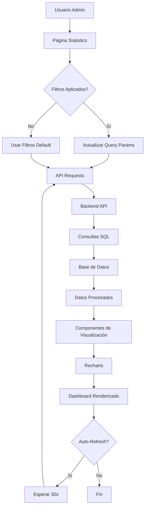
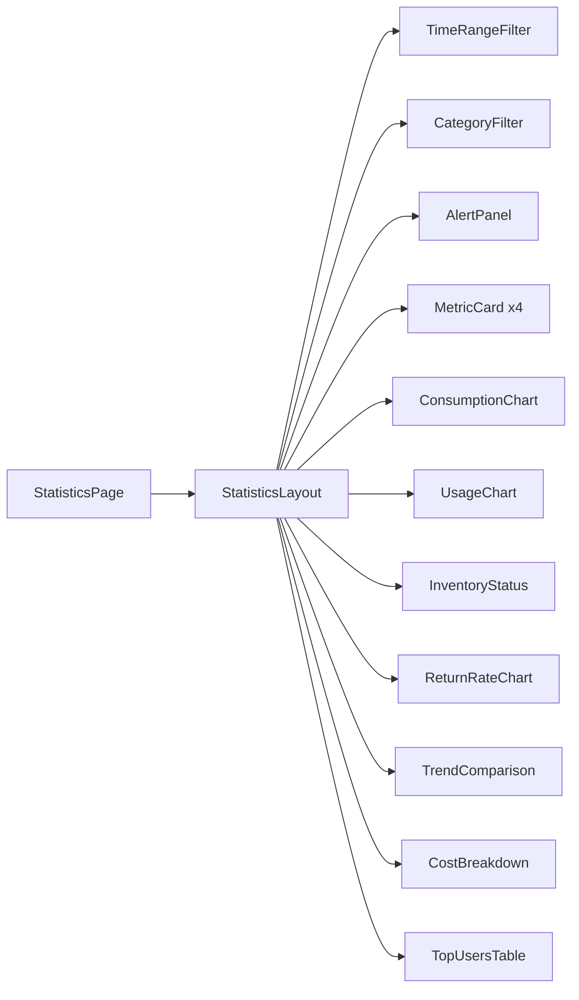

# Documento de Diseño - Panel de Estadísticas

## Visión General

El Panel de Estadísticas es una página web dedicada que proporciona visualizaciones en tiempo real de métricas clave del sistema de inventario. Utiliza React 19, Next.js 15, TypeScript, Tailwind CSS y la librería Recharts para gráficos interactivos. El diseño sigue los patrones establecidos en la aplicación existente y se integra perfectamente con el sistema de autenticación y la API REST.

## Arquitectura

### Estructura de Componentes

```
src/app/admin/statistics/
├── page.tsx                          # Página principal del dashboard
└── loading.tsx                       # Estado de carga

src/components/statistics/
├── index.ts                          # Barrel export
├── StatisticsLayout.tsx              # Layout principal con filtros
├── MetricCard.tsx                    # Tarjeta de métrica individual
├── AlertPanel.tsx                    # Panel de alertas críticas
├── ConsumptionChart.tsx              # Gráfico de consumo de consumibles
├── UsageChart.tsx                    # Gráfico de uso de herramientas/electrónicos
├── InventoryStatus.tsx               # Estado de inventario en tiempo real
├── ReturnRateChart.tsx               # Gráfico de tasa de retorno
├── TrendComparison.tsx               # Comparativa de tendencias
├── TopUsersTable.tsx                 # Tabla de usuarios más activos
├── CostBreakdown.tsx                 # Desglose de costos
├── TimeRangeFilter.tsx               # Filtro de período de tiempo
└── CategoryFilter.tsx                # Filtro de categoría

src/types/statistics.ts               # Tipos TypeScript para estadísticas
src/services/statisticsApi.ts         # API endpoints para estadísticas
```

### Flujo de Datos

```
Usuario → Página Statistics → API Endpoints → Base de Datos
                ↓
         Componentes de Visualización
                ↓
         Recharts (Gráficos)
```

## Componentes e Interfaces

### 1. Página Principal (page.tsx)

**Responsabilidad**: Orquestar el layout del dashboard y gestionar el estado global de filtros.

**Props**: Ninguna (Server Component convertido a Client Component)

**Estado**:
- `timeRange`: Período de tiempo seleccionado
- `category`: Categoría de recurso filtrada
- `refreshInterval`: Intervalo de actualización automática


### 2. StatisticsLayout Component

**Responsabilidad**: Proporcionar el layout principal con filtros y organización de widgets.

**Props**:
```typescript
interface StatisticsLayoutProps {
  children: React.ReactNode
  onTimeRangeChange: (range: TimeRange) => void
  onCategoryChange: (category: string) => void
  timeRange: TimeRange
  category: string
}
```

### 3. MetricCard Component

**Responsabilidad**: Mostrar una métrica individual con valor, título, icono y tendencia.

**Props**:
```typescript
interface MetricCardProps {
  title: string
  value: number | string
  icon: React.ReactNode
  trend?: {
    value: number
    direction: 'up' | 'down' | 'neutral'
  }
  color: 'blue' | 'green' | 'yellow' | 'red' | 'purple'
  onClick?: () => void
}
```

### 4. AlertPanel Component

**Responsabilidad**: Mostrar alertas críticas agrupadas por severidad.

**Props**:
```typescript
interface AlertPanelProps {
  alerts: Alert[]
  onAlertClick: (alert: Alert) => void
}

interface Alert {
  id: number
  type: 'critical' | 'warning' | 'info'
  title: string
  message: string
  link?: string
  timestamp: string
}
```

### 5. ConsumptionChart Component

**Responsabilidad**: Visualizar el consumo de consumibles por mes y usuario.

**Props**:
```typescript
interface ConsumptionChartProps {
  data: ConsumptionData[]
  timeRange: TimeRange
  groupBy: 'month' | 'user' | 'category'
}

interface ConsumptionData {
  period: string
  consumables: {
    [key: string]: number
  }
  total: number
}
```

### 6. UsageChart Component

**Responsabilidad**: Mostrar el uso de herramientas y electrónicos.

**Props**:
```typescript
interface UsageChartProps {
  data: UsageData[]
  type: 'tools' | 'electronics' | 'both'
}

interface UsageData {
  name: string
  totalLoans: number
  activeLoans: number
  availability: number
  avgLoanDuration: number
}
```

### 7. InventoryStatus Component

**Responsabilidad**: Mostrar el estado del inventario en tiempo real con alertas de stock bajo.

**Props**:
```typescript
interface InventoryStatusProps {
  items: InventoryItem[]
  autoRefresh?: boolean
  refreshInterval?: number
}

interface InventoryItem {
  id: number
  name: string
  currentStock: number
  minimumThreshold: number
  status: 'critical' | 'low' | 'normal' | 'high'
  daysUntilEmpty: number | null
  unitOfMeasure: string
}
```


### 8. ReturnRateChart Component

**Responsabilidad**: Visualizar la tasa de retorno de préstamos.

**Props**:
```typescript
interface ReturnRateChartProps {
  data: ReturnRateData
  groupBy: 'global' | 'user' | 'category'
}

interface ReturnRateData {
  totalLoans: number
  onTimeReturns: number
  lateReturns: number
  returnRate: number
  avgDelayDays: number
  byUser?: UserReturnRate[]
}

interface UserReturnRate {
  userId: number
  username: string
  returnRate: number
  lateReturns: number
}
```

### 9. TrendComparison Component

**Responsabilidad**: Comparar tendencias entre diferentes períodos de tiempo.

**Props**:
```typescript
interface TrendComparisonProps {
  currentPeriod: TrendData
  previousPeriod: TrendData
  metrics: string[]
}

interface TrendData {
  period: string
  consumablesUsed: number
  loansCreated: number
  avgLoanDuration: number
  costs: number
}
```

### 10. TopUsersTable Component

**Responsabilidad**: Mostrar ranking de usuarios más activos.

**Props**:
```typescript
interface TopUsersTableProps {
  users: TopUser[]
  limit?: number
  filterBy?: 'loans' | 'consumables' | 'both'
  onUserClick: (userId: number) => void
}

interface TopUser {
  userId: number
  username: string
  email: string
  activeLoans: number
  totalConsumables: number
  totalCost: number
  rank: number
}
```

### 11. CostBreakdown Component

**Responsabilidad**: Visualizar desglose de costos por categoría.

**Props**:
```typescript
interface CostBreakdownProps {
  data: CostData[]
  chartType: 'pie' | 'bar'
}

interface CostData {
  category: string
  cost: number
  percentage: number
  items: number
}
```

## Modelos de Datos

### TimeRange Type

```typescript
type TimeRange = 
  | { type: 'today' }
  | { type: 'week' }
  | { type: 'month' }
  | { type: 'quarter' }
  | { type: 'year' }
  | { type: 'custom', start: string, end: string }
```

### Statistics API Response Types

```typescript
interface DashboardStatistics {
  summary: {
    totalConsumablesUsed: number
    totalLoans: number
    activeLoans: number
    overdueLoans: number
    lowStockItems: number
    totalCost: number
  }
  consumption: ConsumptionData[]
  usage: UsageData[]
  inventory: InventoryItem[]
  returnRate: ReturnRateData
  trends: TrendData[]
  topUsers: TopUser[]
  costs: CostData[]
  alerts: Alert[]
}
```


## API Endpoints

### GET /api/admin/statistics/summary

**Descripción**: Obtiene el resumen general de estadísticas.

**Query Parameters**:
- `timeRange`: string (today, week, month, quarter, year)
- `startDate`: string (ISO 8601) - para rangos personalizados
- `endDate`: string (ISO 8601) - para rangos personalizados
- `category`: string (consumables, tools, electronics, all)

**Response**:
```typescript
{
  data: {
    totalConsumablesUsed: number
    totalLoans: number
    activeLoans: number
    overdueLoans: number
    lowStockItems: number
    totalCost: number
  }
}
```

### GET /api/admin/statistics/consumption

**Descripción**: Obtiene datos de consumo de consumibles.

**Query Parameters**:
- `timeRange`: string
- `groupBy`: string (month, user, category)
- `startDate`: string
- `endDate`: string

**Response**:
```typescript
{
  data: ConsumptionData[]
}
```

### GET /api/admin/statistics/usage

**Descripción**: Obtiene datos de uso de herramientas y electrónicos.

**Query Parameters**:
- `timeRange`: string
- `type`: string (tools, electronics, both)

**Response**:
```typescript
{
  data: UsageData[]
}
```

### GET /api/admin/statistics/inventory

**Descripción**: Obtiene el estado actual del inventario.

**Response**:
```typescript
{
  data: InventoryItem[]
}
```

### GET /api/admin/statistics/return-rate

**Descripción**: Obtiene datos de tasa de retorno.

**Query Parameters**:
- `timeRange`: string
- `groupBy`: string (global, user, category)

**Response**:
```typescript
{
  data: ReturnRateData
}
```

### GET /api/admin/statistics/trends

**Descripción**: Obtiene datos de tendencias para comparación.

**Query Parameters**:
- `currentStart`: string
- `currentEnd`: string
- `previousStart`: string
- `previousEnd`: string

**Response**:
```typescript
{
  data: {
    current: TrendData
    previous: TrendData
    change: {
      consumablesUsed: number
      loansCreated: number
      avgLoanDuration: number
      costs: number
    }
  }
}
```

### GET /api/admin/statistics/top-users

**Descripción**: Obtiene ranking de usuarios más activos.

**Query Parameters**:
- `timeRange`: string
- `limit`: number (default: 20)
- `filterBy`: string (loans, consumables, both)

**Response**:
```typescript
{
  data: TopUser[]
}
```

### GET /api/admin/statistics/costs

**Descripción**: Obtiene desglose de costos.

**Query Parameters**:
- `timeRange`: string
- `groupBy`: string (category, user, month)

**Response**:
```typescript
{
  data: CostData[]
}
```

### GET /api/admin/statistics/alerts

**Descripción**: Obtiene alertas activas del sistema.

**Response**:
```typescript
{
  data: Alert[]
}
```


## Consultas SQL

### Consumo de Consumibles por Mes

```sql
SELECT 
  DATE_TRUNC('month', cr.fulfilled_date) as month,
  it.name as consumable_name,
  it.category,
  SUM(cr.fulfilled_quantity) as total_quantity,
  COUNT(DISTINCT cr.user_id) as unique_users
FROM consumable_requests cr
JOIN item_types it ON cr.item_type_id = it.id
WHERE cr.status = 'fulfilled'
  AND cr.fulfilled_date >= $1
  AND cr.fulfilled_date <= $2
GROUP BY DATE_TRUNC('month', cr.fulfilled_date), it.name, it.category
ORDER BY month DESC, total_quantity DESC;
```

### Consumo por Usuario

```sql
SELECT 
  u.id,
  u.username,
  u.email,
  it.name as consumable_name,
  SUM(cr.fulfilled_quantity) as total_quantity,
  cs.unit_of_measure
FROM consumable_requests cr
JOIN users u ON cr.user_id = u.id
JOIN item_types it ON cr.item_type_id = it.id
LEFT JOIN consumable_stock cs ON cs.item_type_id = it.id
WHERE cr.status = 'fulfilled'
  AND cr.fulfilled_date >= $1
  AND cr.fulfilled_date <= $2
GROUP BY u.id, u.username, u.email, it.name, cs.unit_of_measure
ORDER BY total_quantity DESC;
```

### Uso de Herramientas y Electrónicos

```sql
SELECT 
  it.id,
  it.name,
  it.category,
  COUNT(DISTINCT ti.id) as total_instances,
  COUNT(DISTINCT CASE WHEN ti.status = 'available' THEN ti.id END) as available_count,
  COUNT(DISTINCT CASE WHEN ti.status = 'loaned' THEN ti.id END) as loaned_count,
  COUNT(l.id) as total_loans,
  AVG(EXTRACT(EPOCH FROM (COALESCE(l.return_date, CURRENT_TIMESTAMP) - l.loan_date)) / 86400) as avg_loan_days,
  ROUND((COUNT(DISTINCT CASE WHEN ti.status = 'available' THEN ti.id END)::numeric / 
         NULLIF(COUNT(DISTINCT ti.id), 0) * 100), 2) as availability_percentage
FROM item_types it
LEFT JOIN tool_instances ti ON ti.item_type_id = it.id
LEFT JOIN loans l ON l.tool_instance_id = ti.id
  AND l.loan_date >= $1
  AND l.loan_date <= $2
WHERE it.is_consumable = FALSE
GROUP BY it.id, it.name, it.category
ORDER BY total_loans DESC;
```

### Estado de Inventario en Tiempo Real

```sql
SELECT 
  it.id,
  it.name,
  it.category,
  cs.current_quantity,
  cs.minimum_threshold,
  cs.unit_of_measure,
  CASE 
    WHEN cs.current_quantity = 0 THEN 'critical'
    WHEN cs.current_quantity <= cs.minimum_threshold THEN 'low'
    WHEN cs.current_quantity <= cs.minimum_threshold * 2 THEN 'normal'
    ELSE 'high'
  END as status,
  CASE 
    WHEN avg_daily_consumption.avg_daily > 0 THEN 
      ROUND(cs.current_quantity / avg_daily_consumption.avg_daily)
    ELSE NULL
  END as days_until_empty
FROM item_types it
JOIN consumable_stock cs ON cs.item_type_id = it.id
LEFT JOIN (
  SELECT 
    item_type_id,
    AVG(daily_consumption) as avg_daily
  FROM (
    SELECT 
      item_type_id,
      DATE(fulfilled_date) as day,
      SUM(fulfilled_quantity) as daily_consumption
    FROM consumable_requests
    WHERE status = 'fulfilled'
      AND fulfilled_date >= CURRENT_DATE - INTERVAL '30 days'
    GROUP BY item_type_id, DATE(fulfilled_date)
  ) daily_stats
  GROUP BY item_type_id
) avg_daily_consumption ON avg_daily_consumption.item_type_id = it.id
WHERE it.is_consumable = TRUE
ORDER BY 
  CASE 
    WHEN cs.current_quantity = 0 THEN 1
    WHEN cs.current_quantity <= cs.minimum_threshold THEN 2
    WHEN cs.current_quantity <= cs.minimum_threshold * 2 THEN 3
    ELSE 4
  END,
  cs.current_quantity ASC;
```

### Tasa de Retorno

```sql
SELECT 
  COUNT(*) as total_loans,
  COUNT(CASE WHEN return_date IS NOT NULL AND return_date <= due_date THEN 1 END) as on_time_returns,
  COUNT(CASE WHEN return_date IS NOT NULL AND return_date > due_date THEN 1 END) as late_returns,
  COUNT(CASE WHEN return_date IS NULL AND CURRENT_TIMESTAMP > due_date THEN 1 END) as overdue_loans,
  ROUND((COUNT(CASE WHEN return_date IS NOT NULL AND return_date <= due_date THEN 1 END)::numeric / 
         NULLIF(COUNT(*), 0) * 100), 2) as return_rate_percentage,
  AVG(CASE 
    WHEN return_date IS NOT NULL AND return_date > due_date 
    THEN EXTRACT(EPOCH FROM (return_date - due_date)) / 86400
    WHEN return_date IS NULL AND CURRENT_TIMESTAMP > due_date
    THEN EXTRACT(EPOCH FROM (CURRENT_TIMESTAMP - due_date)) / 86400
    ELSE 0
  END) as avg_delay_days
FROM loans
WHERE loan_date >= $1
  AND loan_date <= $2;
```

### Tasa de Retorno por Usuario

```sql
SELECT 
  u.id,
  u.username,
  u.email,
  COUNT(l.id) as total_loans,
  COUNT(CASE WHEN l.return_date IS NOT NULL AND l.return_date <= l.due_date THEN 1 END) as on_time_returns,
  COUNT(CASE WHEN l.return_date IS NOT NULL AND l.return_date > l.due_date THEN 1 END) as late_returns,
  ROUND((COUNT(CASE WHEN l.return_date IS NOT NULL AND l.return_date <= l.due_date THEN 1 END)::numeric / 
         NULLIF(COUNT(l.id), 0) * 100), 2) as return_rate_percentage
FROM users u
LEFT JOIN loans l ON l.user_id = u.id
  AND l.loan_date >= $1
  AND l.loan_date <= $2
GROUP BY u.id, u.username, u.email
HAVING COUNT(l.id) > 0
ORDER BY late_returns DESC, return_rate_percentage ASC
LIMIT 20;
```


### Top Usuarios Más Activos

```sql
SELECT 
  u.id,
  u.username,
  u.email,
  COUNT(DISTINCT l.id) as total_loans,
  COUNT(DISTINCT CASE WHEN l.status = 'active' THEN l.id END) as active_loans,
  COALESCE(SUM(cr.fulfilled_quantity), 0) as total_consumables,
  0 as total_cost, -- Se calculará en la aplicación basado en precios
  ROW_NUMBER() OVER (ORDER BY 
    COUNT(DISTINCT l.id) + COALESCE(SUM(cr.fulfilled_quantity), 0) DESC
  ) as rank
FROM users u
LEFT JOIN loans l ON l.user_id = u.id
  AND l.loan_date >= $1
  AND l.loan_date <= $2
LEFT JOIN consumable_requests cr ON cr.user_id = u.id
  AND cr.status = 'fulfilled'
  AND cr.fulfilled_date >= $1
  AND cr.fulfilled_date <= $2
GROUP BY u.id, u.username, u.email
HAVING COUNT(DISTINCT l.id) > 0 OR COALESCE(SUM(cr.fulfilled_quantity), 0) > 0
ORDER BY rank
LIMIT $3;
```

### Desglose de Costos por Categoría

```sql
-- Nota: Esta consulta asume que existe una columna 'unit_cost' en item_types
-- Si no existe, se deberá agregar en una migración futura
SELECT 
  it.category,
  SUM(cr.fulfilled_quantity * COALESCE(it.unit_cost, 0)) as total_cost,
  COUNT(DISTINCT cr.id) as total_requests,
  SUM(cr.fulfilled_quantity) as total_quantity
FROM consumable_requests cr
JOIN item_types it ON cr.item_type_id = it.id
WHERE cr.status = 'fulfilled'
  AND cr.fulfilled_date >= $1
  AND cr.fulfilled_date <= $2
GROUP BY it.category
ORDER BY total_cost DESC;
```

### Alertas del Sistema

```sql
-- Stock crítico
SELECT 
  'critical_stock' as alert_type,
  'critical' as severity,
  'Stock Crítico: ' || it.name as title,
  'El stock actual (' || cs.current_quantity || ' ' || cs.unit_of_measure || 
  ') está por debajo del mínimo (' || cs.minimum_threshold || ')' as message,
  '/admin/consumables?id=' || it.id as link,
  CURRENT_TIMESTAMP as timestamp
FROM item_types it
JOIN consumable_stock cs ON cs.item_type_id = it.id
WHERE cs.current_quantity <= cs.minimum_threshold
  AND it.is_consumable = TRUE

UNION ALL

-- Préstamos vencidos
SELECT 
  'overdue_loans' as alert_type,
  CASE 
    WHEN EXTRACT(EPOCH FROM (CURRENT_TIMESTAMP - l.due_date)) / 86400 > 7 THEN 'critical'
    ELSE 'warning'
  END as severity,
  'Préstamo Vencido: ' || u.username as title,
  it.name || ' - Vencido hace ' || 
  ROUND(EXTRACT(EPOCH FROM (CURRENT_TIMESTAMP - l.due_date)) / 86400) || ' días' as message,
  '/admin/loans?id=' || l.id as link,
  l.due_date as timestamp
FROM loans l
JOIN users u ON l.user_id = u.id
JOIN tool_instances ti ON l.tool_instance_id = ti.id
JOIN item_types it ON ti.item_type_id = it.id
WHERE l.status = 'active'
  AND l.return_date IS NULL
  AND CURRENT_TIMESTAMP > l.due_date

UNION ALL

-- Baja disponibilidad
SELECT 
  'low_availability' as alert_type,
  'warning' as severity,
  'Baja Disponibilidad: ' || it.name as title,
  'Solo ' || COUNT(CASE WHEN ti.status = 'available' THEN 1 END) || ' de ' || 
  COUNT(*) || ' unidades disponibles (' || 
  ROUND((COUNT(CASE WHEN ti.status = 'available' THEN 1 END)::numeric / COUNT(*) * 100), 0) || '%)' as message,
  '/admin/tools?id=' || it.id as link,
  CURRENT_TIMESTAMP as timestamp
FROM item_types it
JOIN tool_instances ti ON ti.item_type_id = it.id
WHERE it.is_consumable = FALSE
GROUP BY it.id, it.name
HAVING (COUNT(CASE WHEN ti.status = 'available' THEN 1 END)::numeric / COUNT(*)) < 0.2
  AND COUNT(*) > 0

ORDER BY 
  CASE severity
    WHEN 'critical' THEN 1
    WHEN 'warning' THEN 2
    ELSE 3
  END,
  timestamp DESC;
```

## Manejo de Errores

### Estrategia de Error Handling

1. **Errores de API**: Todos los endpoints deben retornar errores consistentes:
```typescript
{
  error: {
    code: string
    message: string
    details?: any
  }
}
```

2. **Errores de Red**: Implementar retry logic con exponential backoff para fallos temporales.

3. **Errores de Datos**: Validar datos en el frontend antes de enviar y mostrar mensajes claros al usuario.

4. **Estados de Carga**: Mostrar skeletons durante la carga inicial y spinners para actualizaciones.

5. **Fallbacks**: Si un componente falla, mostrar un mensaje de error sin romper todo el dashboard.

### Códigos de Error Específicos

- `STATS_001`: Error al obtener estadísticas generales
- `STATS_002`: Error al calcular consumo
- `STATS_003`: Error al obtener datos de uso
- `STATS_004`: Error al consultar inventario
- `STATS_005`: Error al calcular tasa de retorno
- `STATS_006`: Error al obtener tendencias
- `STATS_007`: Error al consultar usuarios activos
- `STATS_008`: Error al calcular costos
- `STATS_009`: Error al obtener alertas
- `STATS_010`: Parámetros de filtro inválidos


## Estrategia de Testing

### Unit Tests

**Componentes a testear**:
- MetricCard: Renderizado correcto de valores y tendencias
- AlertPanel: Agrupación y ordenamiento de alertas
- TimeRangeFilter: Selección de rangos y validación de fechas personalizadas
- CategoryFilter: Filtrado correcto de categorías

**Utilidades a testear**:
- Funciones de formateo de fechas
- Cálculos de porcentajes y tendencias
- Transformación de datos para gráficos

### Integration Tests

**Flujos a testear**:
1. Carga inicial del dashboard con datos por defecto
2. Aplicación de filtros y actualización de todos los componentes
3. Navegación desde alertas a páginas de detalle
4. Auto-refresh del inventario en tiempo real
5. Exportación de datos a CSV/Excel

### E2E Tests (Opcional)

**Escenarios críticos**:
1. Admin accede al dashboard y ve todas las métricas
2. Admin filtra por período de tiempo y verifica actualización
3. Admin hace clic en alerta y navega a página correcta
4. Dashboard se actualiza automáticamente cada 30 segundos

## Diseño Visual

### Layout Responsivo

**Desktop (>1024px)**:
```
+----------------------------------------------------------+
| Header con Filtros                                        |
+----------------------------------------------------------+
| Panel de Alertas (si hay alertas)                        |
+----------------------------------------------------------+
| [Métrica 1] [Métrica 2] [Métrica 3] [Métrica 4]        |
+----------------------------------------------------------+
| [Gráfico Consumo - 50%]  | [Gráfico Uso - 50%]         |
+----------------------------------------------------------+
| [Estado Inventario - 100%]                               |
+----------------------------------------------------------+
| [Tasa Retorno - 33%] [Tendencias - 33%] [Costos - 33%] |
+----------------------------------------------------------+
| [Tabla Top Usuarios - 100%]                             |
+----------------------------------------------------------+
```

**Tablet (768px - 1024px)**:
```
+----------------------------------------+
| Header con Filtros                     |
+----------------------------------------+
| Panel de Alertas                       |
+----------------------------------------+
| [Métrica 1] [Métrica 2]               |
| [Métrica 3] [Métrica 4]               |
+----------------------------------------+
| [Gráfico Consumo - 100%]              |
+----------------------------------------+
| [Gráfico Uso - 100%]                  |
+----------------------------------------+
| [Estado Inventario - 100%]            |
+----------------------------------------+
| [Tasa Retorno - 100%]                 |
+----------------------------------------+
| [Tendencias - 100%]                   |
+----------------------------------------+
| [Costos - 100%]                       |
+----------------------------------------+
| [Tabla Top Usuarios - 100%]          |
+----------------------------------------+
```

**Mobile (<768px)**:
```
+------------------------+
| Header                 |
+------------------------+
| Filtros (Colapsables) |
+------------------------+
| Panel de Alertas      |
+------------------------+
| [Métrica 1]           |
| [Métrica 2]           |
| [Métrica 3]           |
| [Métrica 4]           |
+------------------------+
| [Gráfico Consumo]     |
+------------------------+
| [Gráfico Uso]         |
+------------------------+
| [Estado Inventario]   |
+------------------------+
| [Tasa Retorno]        |
+------------------------+
| [Tendencias]          |
+------------------------+
| [Costos]              |
+------------------------+
| [Top Usuarios]        |
+------------------------+
```

### Paleta de Colores

Siguiendo el sistema de diseño existente:

- **Azul (Blue)**: Información general, herramientas
- **Verde (Green)**: Métricas positivas, disponibilidad
- **Amarillo (Yellow)**: Advertencias, préstamos activos
- **Rojo (Red)**: Alertas críticas, stock bajo, vencidos
- **Púrpura (Purple)**: Costos, estadísticas especiales

### Iconografía

Utilizar los mismos iconos SVG del sistema existente para mantener consistencia:
- Herramientas: Icono de llave inglesa
- Consumibles: Icono de caja
- Electrónicos: Icono de monitor
- Usuarios: Icono de personas
- Alertas: Icono de campana o exclamación
- Tendencias: Icono de gráfico de líneas
- Costos: Icono de moneda


## Optimización de Performance

### Estrategias de Caching

1. **React Query (RTK Query)**: 
   - Cache de 5 minutos para datos de estadísticas
   - Invalidación automática al realizar acciones que afecten los datos
   - Stale-while-revalidate para mejor UX

2. **Memoización**:
   - Usar `useMemo` para cálculos costosos
   - Usar `useCallback` para funciones pasadas como props
   - Memoizar componentes de gráficos con `React.memo`

3. **Lazy Loading**:
   - Cargar componentes de gráficos de forma diferida
   - Code splitting por ruta

### Optimización de Consultas SQL

1. **Índices**: Asegurar índices en:
   - `consumable_requests.fulfilled_date`
   - `loans.loan_date`
   - `loans.due_date`
   - `loans.return_date`
   - `item_types.category`
   - `item_types.is_consumable`

2. **Agregaciones**: Usar vistas materializadas para cálculos complejos si el volumen de datos crece significativamente.

3. **Paginación**: Implementar paginación en la tabla de top usuarios si hay más de 100 usuarios activos.

### Auto-Refresh Inteligente

```typescript
// Solo actualizar inventario cada 30 segundos
// Otras métricas se actualizan solo cuando el usuario cambia filtros
const useAutoRefresh = (enabled: boolean, interval: number) => {
  const [refreshKey, setRefreshKey] = useState(0)
  
  useEffect(() => {
    if (!enabled) return
    
    const timer = setInterval(() => {
      setRefreshKey(prev => prev + 1)
    }, interval)
    
    return () => clearInterval(timer)
  }, [enabled, interval])
  
  return refreshKey
}
```

## Consideraciones de Seguridad

### Autenticación y Autorización

1. **Protección de Ruta**: Solo administradores pueden acceder a `/admin/statistics`
2. **Validación de Token**: Verificar JWT en cada request a los endpoints de estadísticas
3. **Rate Limiting**: Limitar requests a 100 por minuto por usuario
4. **Sanitización**: Sanitizar todos los parámetros de query para prevenir SQL injection

### Datos Sensibles

1. **Información de Usuarios**: No exponer datos sensibles como contraseñas o tokens
2. **Costos**: Solo mostrar costos a administradores con permisos específicos
3. **Logs de Auditoría**: Registrar accesos al dashboard de estadísticas

## Internacionalización (i18n)

Preparar el dashboard para soporte multiidioma:

```typescript
// Ejemplo de keys de traducción
const translations = {
  es: {
    'statistics.title': 'Panel de Estadísticas',
    'statistics.consumption': 'Consumo de Materiales',
    'statistics.usage': 'Uso de Herramientas',
    'statistics.inventory': 'Estado de Inventario',
    'statistics.returnRate': 'Tasa de Retorno',
    'statistics.trends': 'Tendencias',
    'statistics.costs': 'Costos',
    'statistics.topUsers': 'Usuarios Más Activos',
    'statistics.alerts': 'Alertas',
    // ... más traducciones
  },
  en: {
    'statistics.title': 'Statistics Dashboard',
    'statistics.consumption': 'Material Consumption',
    'statistics.usage': 'Tool Usage',
    // ... más traducciones
  }
}
```

## Exportación de Datos

### Formatos Soportados

1. **CSV**: Para datos tabulares (top usuarios, inventario)
2. **Excel**: Para reportes completos con múltiples hojas
3. **PDF**: Para reportes visuales con gráficos (futuro)

### Implementación

```typescript
// Utilizar la librería xlsx existente
import * as XLSX from 'xlsx'

const exportToExcel = (data: any[], filename: string) => {
  const ws = XLSX.utils.json_to_sheet(data)
  const wb = XLSX.utils.book_new()
  XLSX.utils.book_append_sheet(wb, ws, 'Estadísticas')
  XLSX.writeFile(wb, `${filename}_${new Date().toISOString()}.xlsx`)
}
```

## Diagramas

### Diagrama de Flujo de Datos



### Diagrama de Componentes



## Decisiones de Diseño y Justificaciones

### 1. Uso de Recharts

**Decisión**: Utilizar Recharts para todos los gráficos.

**Justificación**: 
- Ya está incluido en las dependencias del proyecto
- Excelente soporte para React y TypeScript
- Gráficos responsivos out-of-the-box
- Personalización mediante props simples

### 2. Auto-Refresh Selectivo

**Decisión**: Solo auto-refresh para el componente de inventario.

**Justificación**:
- El inventario cambia frecuentemente y es crítico
- Otras métricas son más estáticas y no requieren actualización constante
- Reduce carga en el servidor y mejora performance

### 3. Estructura de API Modular

**Decisión**: Múltiples endpoints específicos en lugar de uno monolítico.

**Justificación**:
- Permite cargar solo los datos necesarios
- Facilita el caching granular
- Mejor performance al filtrar
- Más fácil de mantener y testear

### 4. Cálculo de Costos en Aplicación

**Decisión**: Calcular costos totales en el frontend cuando sea posible.

**Justificación**:
- Flexibilidad para aplicar diferentes tasas o descuentos
- Reduce complejidad de consultas SQL
- Permite actualizar precios sin migrar datos históricos

### 5. Diseño Mobile-First

**Decisión**: Diseñar primero para móvil y escalar hacia desktop.

**Justificación**:
- Consistente con el resto de la aplicación
- Muchos administradores pueden acceder desde tablets
- Mejor experiencia en todos los dispositivos
