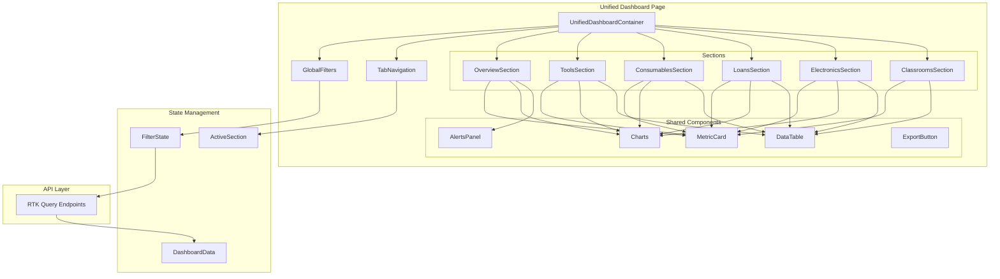

# Design Document: Unified Reports Dashboard

## Overview

El Dashboard Unificado de Reportes consolida todas las estadísticas y reportes del sistema de inventario en una única página centralizada. Reemplaza la navegación fragmentada entre `/admin/statistics`, `/admin/reports/*` y `/admin/dashboard` con una experiencia unificada que permite a los administradores acceder a toda la información desde un solo lugar.

La arquitectura se basa en un diseño modular con tabs/secciones que cargan datos de forma independiente, filtros globales que propagan cambios a todos los componentes, y componentes reutilizables para métricas, gráficos y tablas.

## Architecture



## Components and Interfaces

### Main Container Component

```typescript
// UnifiedDashboardContainer.tsx
interface UnifiedDashboardProps {
  initialSection?: DashboardSection;
}

type DashboardSection = 
  | 'overview' 
  | 'tools' 
  | 'consumables' 
  | 'loans' 
  | 'electronics' 
  | 'classrooms';

interface DashboardState {
  activeSection: DashboardSection;
  filters: GlobalFilters;
}
```

### Global Filters Component

```typescript
// GlobalFilters.tsx
interface GlobalFilters {
  dateRange: {
    type: 'week' | 'month' | 'quarter' | 'year' | 'custom';
    start?: string;
    end?: string;
  };
  category?: string;
}

interface GlobalFiltersProps {
  value: GlobalFilters;
  onChange: (filters: GlobalFilters) => void;
  categories: string[];
}
```

### Section Components

```typescript
// OverviewSection.tsx
interface OverviewSectionProps {
  filters: GlobalFilters;
}

// ToolsSection.tsx
interface ToolsSectionProps {
  filters: GlobalFilters;
  onDrillDown: (metric: string, data: any) => void;
}

// ConsumablesSection.tsx
interface ConsumablesSectionProps {
  filters: GlobalFilters;
  onDrillDown: (metric: string, data: any) => void;
}

// LoansSection.tsx
interface LoansSectionProps {
  filters: GlobalFilters;
  onDrillDown: (metric: string, data: any) => void;
}

// ElectronicsSection.tsx
interface ElectronicsSectionProps {
  filters: GlobalFilters;
  onDrillDown: (metric: string, data: any) => void;
}

// ClassroomsSection.tsx
interface ClassroomsSectionProps {
  filters: GlobalFilters;
  selectedClassroom?: number;
  onClassroomSelect: (classroomId: number) => void;
}
```

### Shared Components

```typescript
// MetricCard.tsx (enhanced from existing)
interface MetricCardProps {
  title: string;
  value: number | string;
  icon: React.ReactNode;
  color: 'blue' | 'green' | 'yellow' | 'red' | 'purple' | 'orange';
  trend?: {
    value: number;
    direction: 'up' | 'down';
    label: string;
  };
  onClick?: () => void;
  loading?: boolean;
}

// UnifiedChart.tsx
interface UnifiedChartProps {
  type: 'line' | 'bar' | 'pie' | 'doughnut';
  data: ChartData;
  title: string;
  loading?: boolean;
  height?: number;
}

// UnifiedDataTable.tsx
interface UnifiedDataTableProps<T> {
  data: T[];
  columns: ColumnConfig<T>[];
  loading?: boolean;
  pagination?: {
    page: number;
    pageSize: number;
    total: number;
    onPageChange: (page: number) => void;
  };
  sorting?: {
    field: string;
    direction: 'asc' | 'desc';
    onSort: (field: string) => void;
  };
  searchable?: boolean;
  onSearch?: (term: string) => void;
  onRowClick?: (row: T) => void;
}

// AlertsPanel.tsx (enhanced from existing)
interface AlertsPanelProps {
  alerts: Alert[];
  onAlertClick: (alert: Alert) => void;
  loading?: boolean;
}

interface Alert {
  id: string;
  type: 'low_stock' | 'overdue_loan' | 'maintenance' | 'warning';
  title: string;
  message: string;
  severity: 'info' | 'warning' | 'error';
  link?: string;
  count?: number;
  timestamp: string;
}
```

### Export Functionality

```typescript
// useExportDashboard.ts
interface ExportOptions {
  sections: DashboardSection[];
  filters: GlobalFilters;
  format: 'xlsx' | 'csv';
}

interface ExportResult {
  filename: string;
  sheets: {
    name: string;
    data: any[];
  }[];
  metadata: {
    exportDate: string;
    filters: GlobalFilters;
    generatedBy: string;
  };
}
```

### User Consumption Component

```typescript
// UserConsumptionSection.tsx
interface UserConsumption {
  userId: number;
  username: string;
  email: string;
  totalQuantity: number;
  totalCost: number;
  byType: {
    typeId: number;
    typeName: string;
    quantity: number;
    cost: number;
  }[];
  trend: {
    period: string;
    quantity: number;
  }[];
}

interface UserConsumptionSectionProps {
  filters: GlobalFilters;
  sortBy: 'quantity' | 'cost' | 'name';
  sortDirection: 'asc' | 'desc';
  onSortChange: (field: string, direction: 'asc' | 'desc') => void;
}
```

### Electronics Movement Component

```typescript
// ElectronicsMovementSection.tsx
interface DeviceMovement {
  id: number;
  deviceId: number;
  deviceName: string;
  serialNumber: string;
  fromClassroom: {
    id: number;
    name: string;
  } | null;
  toClassroom: {
    id: number;
    name: string;
  };
  transferDate: string;
  responsibleUser: {
    id: number;
    username: string;
  };
  notes?: string;
}

interface ElectronicsMovementProps {
  filters: GlobalFilters;
  classroomFilter?: number;
  deviceFilter?: number;
}
```

## Data Models

### Dashboard Summary Data

```typescript
interface DashboardSummary {
  tools: {
    total: number;
    available: number;
    loaned: number;
    maintenance: number;
    byCategory: { category: string; count: number }[];
  };
  consumables: {
    totalTypes: number;
    totalStock: number;
    lowStockCount: number;
    byCategory: { category: string; count: number }[];
  };
  loans: {
    active: number;
    overdue: number;
    returned: number;
    total: number;
    byStatus: { status: string; count: number }[];
  };
  electronics: {
    total: number;
    assigned: number;
    unassigned: number;
    byBrand: { brand: string; count: number }[];
    byStatus: { status: string; count: number }[];
  };
  classrooms: {
    total: number;
    withDevices: number;
    totalAssignments: number;
  };
  users: {
    total: number;
    active: number;
  };
}
```

### Time Series Data

```typescript
interface TimeSeriesData {
  labels: string[];
  datasets: {
    label: string;
    data: number[];
    color?: string;
  }[];
}

interface ConsumptionTrend extends TimeSeriesData {
  period: 'daily' | 'weekly' | 'monthly';
  totalConsumption: number;
}

interface LoanActivityTrend extends TimeSeriesData {
  period: 'daily' | 'weekly' | 'monthly';
  totalLoans: number;
  totalReturns: number;
}
```

### User Activity Data

```typescript
interface TopUser {
  rank: number;
  userId: number;
  username: string;
  email: string;
  activeLoans: number;
  totalConsumables: number;
  totalCost: number;
  lastActivity: string;
}

interface UserConsumptionDetail {
  userId: number;
  username: string;
  consumptions: {
    consumableId: number;
    consumableName: string;
    quantity: number;
    date: string;
  }[];
  totalQuantity: number;
  totalCost: number;
}
```

### Device Assignment Data

```typescript
interface ClassroomDeviceAssignment {
  classroomId: number;
  classroomName: string;
  building?: string;
  floor?: string;
  devices: {
    deviceId: number;
    deviceName: string;
    brand: string;
    model: string;
    serialNumber: string;
    status: string;
    assignedDate: string;
  }[];
  totalDevices: number;
}

interface DeviceTransferHistory {
  deviceId: number;
  deviceName: string;
  serialNumber: string;
  currentClassroom: string | null;
  transfers: DeviceMovement[];
}
```

## Correctness Properties

*A property is a characteristic or behavior that should hold true across all valid executions of a system-essentially, a formal statement about what the system should do. Properties serve as the bridge between human-readable specifications and machine-verifiable correctness guarantees.*

### Property 1: Date Range Filter Propagation
*For any* date range filter selection, all time-sensitive metrics and charts across all sections should reflect data only within the selected date range.
**Validates: Requirements 2.1**

### Property 2: Category Filter Propagation
*For any* category filter selection, all applicable sections should display data filtered to that category only.
**Validates: Requirements 2.2**

### Property 3: Filter State Persistence
*For any* filter combination applied, navigating between sections and returning should preserve the exact filter state.
**Validates: Requirements 2.3**

### Property 4: Export Data Consistency
*For any* export operation, the generated Excel file should contain data that matches the currently visible filtered data.
**Validates: Requirements 4.1**

### Property 5: Export Filter Metadata
*For any* export with filters applied, the export metadata should include all active filter values.
**Validates: Requirements 4.2**

### Property 6: Low Stock Alert Generation
*For any* consumable item with current stock below its minimum threshold, a low stock alert should exist in the alerts panel.
**Validates: Requirements 5.1**

### Property 7: Overdue Loan Alert Generation
*For any* loan past its due date that has not been returned, an overdue loan alert should exist in the alerts panel.
**Validates: Requirements 5.2**

### Property 8: Alert Badge Count Accuracy
*For any* state of the system, the alert badge count should equal the total number of active alerts.
**Validates: Requirements 5.4**

### Property 9: Table Sorting Correctness
*For any* sortable table column and sort direction, the displayed rows should be correctly ordered by that column.
**Validates: Requirements 6.2**

### Property 10: Drill-down Filter Preservation
*For any* drill-down action from a summary metric, the detailed view should maintain all currently applied global filters.
**Validates: Requirements 6.3**

### Property 11: Table Search Filtering
*For any* search term entered in a data table, all displayed rows should contain the search term in at least one searchable field.
**Validates: Requirements 6.4**

### Property 12: Section Error Isolation
*For any* API failure in one section, all other sections should continue to display their data correctly.
**Validates: Requirements 7.4**

### Property 13: Top Users Ranking Correctness
*For any* top users list, users should be sorted in descending order by their activity score.
**Validates: Requirements 8.1**

### Property 14: Top Users Activity Type Filter
*For any* activity type filter (loans, consumables, or both), the top users list should only include users with activity of that type.
**Validates: Requirements 8.4**

### Property 15: Classroom Device Distribution Sum
*For any* classroom device distribution view, the sum of devices across all classrooms should equal the total assigned devices count.
**Validates: Requirements 10.2**

### Property 16: User Consumption Aggregation Consistency
*For any* user, the sum of consumption quantities by consumable type should equal the user's total consumption quantity.
**Validates: Requirements 11.1, 11.2**

### Property 17: User Consumption Date Filter
*For any* date range filter, user consumption totals should only include consumptions within that date range.
**Validates: Requirements 11.4**

### Property 18: User Consumption Sorting
*For any* sort by consumption quantity, users should be correctly ordered by their total consumption.
**Validates: Requirements 11.5**

### Property 19: Classroom Device History Filter
*For any* classroom filter, the device list should include all devices currently assigned AND all devices previously assigned to that classroom.
**Validates: Requirements 12.4**

## Error Handling

### API Error Handling

```typescript
interface SectionErrorState {
  hasError: boolean;
  errorMessage: string;
  retryCount: number;
  lastAttempt: Date;
}

// Each section maintains independent error state
// Errors in one section don't affect others
// Retry mechanism with exponential backoff
```

### Error Display

- Each section shows its own error state with retry button
- Global error banner for critical failures (auth, network)
- Toast notifications for transient errors
- Graceful degradation: show cached data when available

### Validation Errors

- Filter validation before API calls
- Date range validation (start <= end)
- Export validation (at least one section selected)

## Testing Strategy

### Unit Testing

Unit tests will cover:
- Individual component rendering
- Filter state management
- Data transformation utilities
- Export file generation

### Property-Based Testing

The project will use **fast-check** as the property-based testing library for TypeScript/JavaScript.

Each property-based test MUST:
- Be tagged with a comment referencing the correctness property: `**Feature: unified-reports-dashboard, Property {number}: {property_text}**`
- Run a minimum of 100 iterations
- Use smart generators that constrain to valid input spaces

Property tests will verify:
- Filter propagation across sections
- Data aggregation correctness (sums, counts)
- Sorting correctness
- Alert generation logic
- Export data consistency

### Integration Testing

Integration tests will cover:
- Full dashboard rendering with mock data
- Filter interactions across sections
- Navigation between sections
- Export functionality end-to-end

### Test File Organization

```
src/
├── components/
│   └── unified-dashboard/
│       ├── __tests__/
│       │   ├── UnifiedDashboard.test.tsx
│       │   ├── GlobalFilters.test.tsx
│       │   ├── sections/
│       │   │   ├── OverviewSection.test.tsx
│       │   │   └── ...
│       │   └── properties/
│       │       ├── filterPropagation.property.test.ts
│       │       ├── dataAggregation.property.test.ts
│       │       ├── alertGeneration.property.test.ts
│       │       └── sorting.property.test.ts
```
