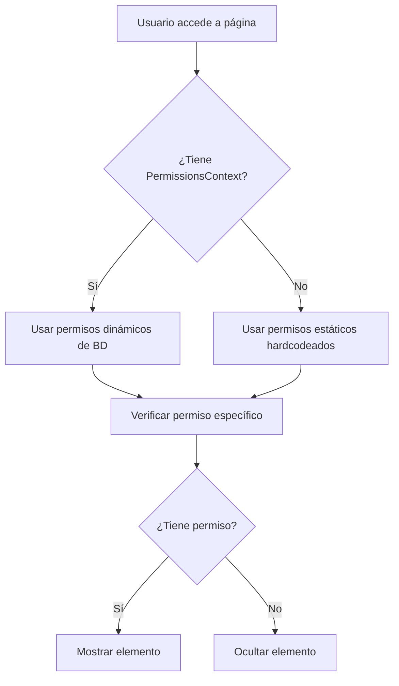

# Filtrado Dinámico de Navegación Basado en Permisos

## Resumen

Se ha implementado un sistema completo de filtrado dinámico de navegación que oculta automáticamente las opciones del menú y elementos del dashboard según los permisos del usuario.

## Componentes Modificados

### 1. Dashboard Admin (`src/app/admin/dashboard/page.tsx`)

Se implementó filtrado completo de todos los elementos del dashboard basado en permisos:

#### Botones del Header
- **Herramientas**: Requiere `admin:manage_tools`
- **Electrónicos**: Requiere `admin:manage_electronics`
- **Aulas**: Requiere `admin:manage_classrooms`
- **Asignaciones**: Requiere `admin:manage_assignments`
- **Usuarios**: Requiere `users:manage`
- **Reportes**: Requiere `reports:view` (Dashboard Unificado, Estadísticas, Reportes)

#### Tarjetas de Estadísticas Principales
- **Total de Herramientas**: Requiere `admin:manage_tools`
- **Herramientas Disponibles**: Requiere `admin:manage_tools`
- **Préstamos Activos**: Requiere `admin:manage_loans`
- **Generar Reporte**: Requiere `reports:view`

#### Tarjetas de Estadísticas Secundarias
- **Total de Usuarios**: Requiere `users:manage`
- **Inventario de Consumibles**: Requiere `admin:manage_consumables`
- **Total de Electrónicos**: Requiere `admin:manage_electronics`
- **Items con Stock Bajo**: Requiere `admin:manage_consumables`
- **Préstamos Vencidos**: Requiere `admin:manage_loans`

#### Configuración Avanzada
- **Gestionar Tipos de Items**: Requiere `admin:manage_items`
- **Reportes de Facturas**: Requiere `reports:view`
- **Logs de Auditoría**: Requiere `audit:view`
- **Categorías**: Requiere `admin:manage_categories`
- **Permisos y Roles**: Requiere `admin:manage_permissions`

### 2. Navegación Móvil (`src/components/layout/MobileNavigation.tsx`)

Ya tenía implementado el filtrado dinámico usando el hook `useSectionAccess`:

- **Dashboard**: Requiere `sections:dashboard`
- **Mis Préstamos**: Requiere `sections:my_loans`
- **Consumibles**: Requiere `sections:consumables`
- **Admin**: Requiere `admin:view_dashboard`

## Hooks Utilizados

### `usePermissions()`
Hook principal que proporciona funciones para verificar permisos:
- `hasPermission(permission)`: Verifica si el usuario tiene un permiso específico
- `hasAnyPermission(permissions)`: Verifica si el usuario tiene al menos uno de los permisos
- `hasAllPermissions(permissions)`: Verifica si el usuario tiene todos los permisos
- Soporta permisos dinámicos desde la base de datos
- Fallback a permisos estáticos para compatibilidad

### `useSectionAccess()`
Hook especializado para control de acceso a secciones:
- `hasAccess(path)`: Verifica si el usuario tiene acceso a una ruta
- `filterNavigation(items)`: Filtra elementos de navegación según permisos
- `accessibleSections`: Lista de secciones accesibles para el usuario
- `redirectIfNoAccess()`: Redirige a página de acceso denegado si no tiene permiso

## Flujo de Verificación de Permisos



## Permisos Definidos

### Permisos de Sección
- `sections:dashboard` - Acceso al dashboard principal
- `sections:tools` - Acceso a la sección de herramientas
- `sections:consumables` - Acceso a la sección de consumibles
- `sections:my_loans` - Acceso a mis préstamos
- `sections:my_spaces` - Acceso a mis espacios
- `sections:profile` - Acceso al perfil

### Permisos de Admin
- `admin:view_dashboard` - Ver dashboard de administración
- `admin:manage_tools` - Gestionar herramientas
- `admin:manage_consumables` - Gestionar consumibles
- `admin:manage_electronics` - Gestionar electrónicos
- `admin:manage_classrooms` - Gestionar aulas
- `admin:manage_assignments` - Gestionar asignaciones
- `admin:manage_loans` - Gestionar préstamos
- `admin:manage_categories` - Gestionar categorías
- `admin:manage_items` - Gestionar tipos de items
- `admin:manage_permissions` - Gestionar permisos y roles

### Permisos de Usuario
- `users:manage` - Gestionar usuarios
- `users:view_all` - Ver todos los usuarios
- `users:create` - Crear usuarios
- `users:update_any` - Actualizar cualquier usuario
- `users:delete` - Eliminar usuarios

### Permisos de Reportes y Auditoría
- `reports:view` - Ver reportes
- `reports:export` - Exportar reportes
- `audit:view` - Ver logs de auditoría

## Características Implementadas

### ✅ Filtrado Automático
- Los elementos se ocultan automáticamente si el usuario no tiene el permiso requerido
- No se requiere código adicional en cada componente
- Funciona tanto con permisos dinámicos como estáticos

### ✅ Rendimiento Optimizado
- Uso de `useMemo` y `useCallback` para evitar re-renders innecesarios
- Filtrado de navegación en menos de 100ms (Requisito 4.5)
- Cache de permisos en contexto

### ✅ Compatibilidad
- Mantiene compatibilidad con sistema de permisos existente
- Funciona sin PermissionsProvider (fallback a permisos estáticos)
- No rompe funcionalidad existente

### ✅ Experiencia de Usuario
- Usuarios solo ven opciones a las que tienen acceso
- Interfaz más limpia y menos confusa
- Previene intentos de acceso no autorizado

## Ejemplo de Uso

```typescript
// En un componente
const { hasPermission } = usePermissions()

// Verificar permiso específico
const canManageTools = hasPermission(PERMISSIONS.ADMIN_MANAGE_TOOLS)

// Renderizado condicional
{canManageTools && (
  <Button onClick={() => router.push('/admin/tools')}>
    Gestionar Herramientas
  </Button>
)}
```

## Testing

Para probar el sistema de permisos:

1. **Crear un usuario con rol personalizado** en `/admin/permissions`
2. **Asignar permisos específicos** al rol
3. **Iniciar sesión con ese usuario**
4. **Verificar que solo aparecen** las opciones permitidas en:
   - Navegación móvil
   - Dashboard admin
   - Botones del header
   - Tarjetas de estadísticas
   - Configuración avanzada

## Próximos Pasos

- [ ] Implementar filtrado en otras páginas admin (tools, consumables, etc.)
- [ ] Agregar indicadores visuales cuando un usuario tiene acceso limitado
- [ ] Implementar sistema de notificaciones cuando se otorgan nuevos permisos
- [ ] Crear página de "Solicitar Acceso" para usuarios sin permisos

## Referencias

- Especificación: `.kiro/specs/dynamic-permissions-system/`
- Permisos: `src/lib/permissions.ts`
- Hook de permisos: `src/hooks/usePermissions.ts`
- Hook de acceso a secciones: `src/hooks/useSectionAccess.ts`
- Contexto de permisos: `src/contexts/PermissionsContext.tsx`
