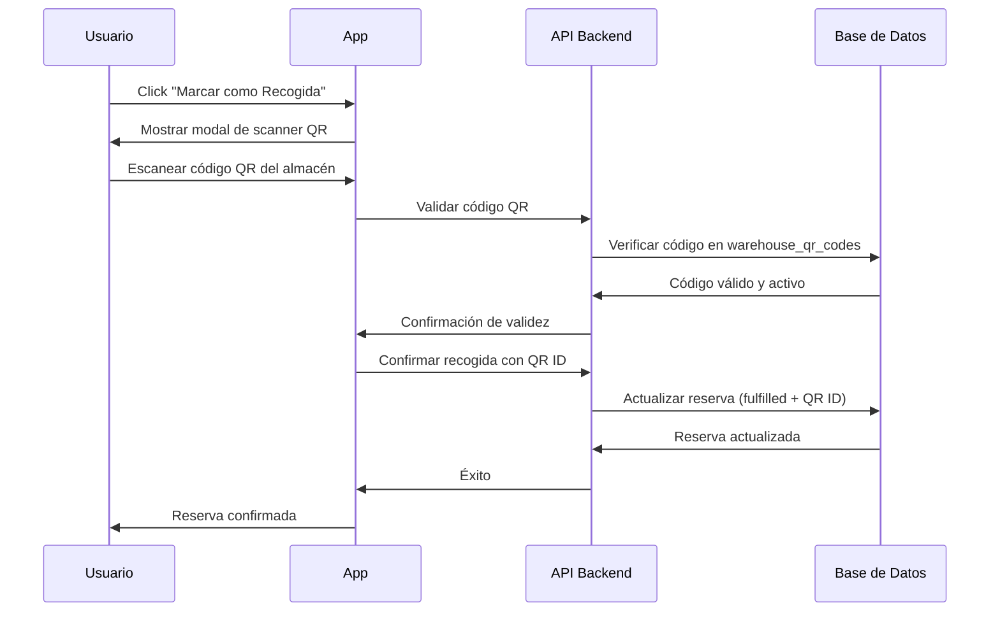

# 🏢 Sistema de Verificación por QR del Almacén

## Descripción General

El sistema de verificación por QR del almacén es una capa de seguridad adicional que garantiza que los usuarios estén físicamente presentes en el almacén cuando confirman la recogida de sus reservas de materiales consumibles.

## Objetivo

Prevenir que usuarios confirmen reservas de forma remota sin haber recogido realmente los materiales, asegurando la integridad del sistema de inventario.

## Funcionamiento

### 1. Códigos QR del Almacén

Se han distribuido **5 códigos QR** en diferentes ubicaciones estratégicas del almacén:

| Código | Ubicación | Zona | Descripción |
|--------|-----------|------|-------------|
| `WH-QR-001-ENTRANCE` | Entrada Principal | General | En la puerta de entrada del almacén |
| `WH-QR-002-TOOLS` | Zona de Herramientas | Tools | Área de herramientas y equipos |
| `WH-QR-003-CONSUMABLES` | Zona de Consumibles | Consumables | Área de materiales consumibles |
| `WH-QR-004-ELECTRONICS` | Zona de Electrónicos | Electronics | Área de dispositivos electrónicos |
| `WH-QR-005-EXIT` | Salida del Almacén | General | Cerca de la salida |

### 2. Proceso de Verificación



### 3. Flujo de Usuario

1. **Usuario tiene una reserva activa**
   - Ve sus reservas en "Mis Reservas"
   - Identifica la reserva que desea confirmar

2. **Intenta confirmar recogida**
   - Click en "Marcar como Recogida"
   - Se abre el modal del scanner QR

3. **Escanea código QR**
   - Debe estar físicamente en el almacén
   - Escanea cualquiera de los 5 códigos QR disponibles
   - El sistema valida el código en tiempo real

4. **Confirmación**
   - Si el código es válido: reserva confirmada
   - Si el código es inválido: mensaje de error
   - Se registra qué código QR fue escaneado

## Implementación Técnica

### Base de Datos

#### Tabla: `warehouse_qr_codes`

```sql
CREATE TABLE warehouse_qr_codes (
  id SERIAL PRIMARY KEY,
  qr_code VARCHAR(255) UNIQUE NOT NULL,
  location_name VARCHAR(100) NOT NULL,
  location_description TEXT,
  zone VARCHAR(50),
  is_active BOOLEAN DEFAULT TRUE,
  created_at TIMESTAMP DEFAULT CURRENT_TIMESTAMP,
  updated_at TIMESTAMP DEFAULT CURRENT_TIMESTAMP
);
```

#### Modificación: `consumable_reservations`

```sql
ALTER TABLE consumable_reservations 
ADD COLUMN warehouse_qr_code_id INTEGER REFERENCES warehouse_qr_codes(id);
```

### API Endpoints

#### POST `/api/warehouse/validate-qr`

Valida que un código QR pertenece al almacén y está activo.

**Request:**
```json
{
  "qr_code": "WH-QR-001-ENTRANCE"
}
```

**Response (éxito):**
```json
{
  "success": true,
  "data": {
    "id": 1,
    "location": "Entrada Principal",
    "zone": "general"
  }
}
```

**Response (error):**
```json
{
  "error": "Código QR no válido",
  "message": "Este código no pertenece al almacén..."
}
```

#### POST `/api/reservations/[id]/fulfill`

Ahora requiere el ID del código QR escaneado.

**Request:**
```json
{
  "warehouse_qr_code_id": 1
}
```

### Componentes Frontend

#### `MyReservationsModal.tsx`

- Integra el componente `QRScanner`
- Maneja el flujo de validación
- Muestra errores de forma clara
- Proporciona información sobre ubicaciones de QR

#### `QRScanner.tsx`

- Componente reutilizable existente
- Soporta escaneo con cámara
- Opción de entrada manual como fallback

## Instalación de Códigos QR

### Generación

1. Abrir `scripts/generate-warehouse-qr-codes.html` en un navegador
2. Click en "Imprimir Todos"
3. Guardar como PDF o imprimir directamente

### Instalación Física

1. **Materiales necesarios:**
   - Códigos QR impresos (preferiblemente a color)
   - Laminadora o fundas plásticas
   - Cinta adhesiva de doble cara o marco
   - Nivel (opcional)

2. **Proceso:**
   - Plastificar cada código QR
   - Limpiar la superficie donde se instalará
   - Colocar a altura de 1.2 - 1.5 metros
   - Asegurar buena iluminación
   - Verificar que sea escaneable con la app

3. **Ubicaciones recomendadas:**
   - **Entrada:** Junto al marco de la puerta, lado derecho
   - **Herramientas:** En pared visible desde el pasillo principal
   - **Consumibles:** Cerca del área de picking
   - **Electrónicos:** En zona de acceso controlado
   - **Salida:** Visible al salir, lado izquierdo

## Seguridad

### Ventajas

✅ **Verificación física:** Garantiza presencia en el almacén
✅ **Múltiples puntos:** 5 códigos distribuidos evitan cuellos de botella
✅ **Trazabilidad:** Se registra qué código fue escaneado y cuándo
✅ **Prevención de fraude:** Imposible confirmar remotamente
✅ **Auditoría:** Estadísticas de uso por zona

### Consideraciones

⚠️ **Códigos visibles:** No deben ser accesibles desde fuera del almacén
⚠️ **Mantenimiento:** Revisar periódicamente el estado de los códigos
⚠️ **Backup:** Tener códigos de respaldo en caso de daño
⚠️ **Desactivación:** Posibilidad de desactivar códigos comprometidos

## Estadísticas y Reportes

### Vista: `warehouse_qr_scan_stats`

Proporciona estadísticas de uso de cada código QR:

```sql
SELECT 
  qr_code,
  location_name,
  total_scans,
  scans_last_7_days,
  scans_last_30_days,
  last_scan_date
FROM warehouse_qr_scan_stats
ORDER BY total_scans DESC;
```

### Métricas útiles

- **Código más usado:** Identifica zonas de mayor tráfico
- **Códigos sin uso:** Detecta problemas de ubicación o visibilidad
- **Patrones temporales:** Horarios pico de recogida
- **Distribución por zona:** Balance de uso del almacén

## Mantenimiento

### Tareas Regulares

- **Semanal:** Verificar que todos los códigos sean escaneables
- **Mensual:** Limpiar códigos QR y revisar adhesivos
- **Trimestral:** Analizar estadísticas de uso
- **Anual:** Considerar reubicación basada en datos

### Solución de Problemas

| Problema | Causa Probable | Solución |
|----------|----------------|----------|
| Código no escanea | Daño físico, suciedad | Limpiar o reemplazar |
| Error "código inválido" | Código no en BD | Verificar migración ejecutada |
| Código desactivado | `is_active = false` | Reactivar en BD si es seguro |
| Lentitud al escanear | Mala iluminación | Mejorar iluminación del área |

## Migración

### Aplicar Migración

```bash
# Ejecutar migración en Supabase
psql -h [host] -U [user] -d [database] -f supabase/migrations/011_warehouse_qr_codes.sql
```

### Verificar Instalación

```sql
-- Verificar que los 5 códigos existen
SELECT COUNT(*) FROM warehouse_qr_codes WHERE is_active = true;
-- Debe retornar: 5

-- Ver todos los códigos
SELECT qr_code, location_name, zone FROM warehouse_qr_codes;
```

## Futuras Mejoras

### Posibles Extensiones

1. **Geolocalización adicional:** Validar ubicación GPS del dispositivo
2. **Códigos dinámicos:** Rotar códigos periódicamente
3. **Notificaciones:** Alertar a admins de patrones sospechosos
4. **Integración con cámaras:** Registro fotográfico de recogidas
5. **Códigos por zona específica:** Requerir escaneo en zona del material
6. **Tiempo límite:** Ventana de tiempo entre escaneo y confirmación

## Soporte

Para problemas o preguntas:
- Revisar logs en `/api/warehouse/validate-qr`
- Verificar estado de códigos en base de datos
- Consultar estadísticas de uso
- Contactar al administrador del sistema
